# 1、特性描述

操作系统作作为所有软件的基座，代码量巨大，社区会及时修复每一个发现的安全漏洞和缺陷，如果不及时修复这些问题，可能会带来系统安全隐患和宕机的风险。当前社区存在如下问题：  
1. 目前仅有修复发布，无工具支持检查运行系统CVE和缺陷状态，依赖人为检查，存在实时性和遗漏风险  
2. 无热修复发布，仅支持热修复（内核/用户态热补丁）工具，但是需要用户自己制作，使用复杂  
3. 无集群巡检和管理能力，管理员维护繁复  

aops-apollo为了应对如上问题，提供了缺陷（CVE/bugfix）巡检&修复功能，该功能能够定时扫描集群中主机的缺陷信息，并及时呈现给用户，用户可以在web界面上进行这些缺陷的处理。

## 1.1、受益人

| 角色     | 角色描述                                               |
| :------- | :----------------------------------------------------- |
| 运维人员 | 负责机器运维管理的人员，及时发现和修复软件缺陷         |
| 普通用户 | 个体用户，注册服务后，依赖于该系统对自己的机器进行监控 |


## 1.2、依赖组件

| 组件          | 组件描述                         | 可获得性                        |
| :------------ | :------------------------------- | :------------------------------ |
| mysql         | 关系型数据库                     | 使用openEuler repo源yum install |
| aops-vulcanus | A-Ops工具包                      | 使用openEuler repo源yum install |
| aops-zeus     | A-Ops资产管理模块，添加主机需要  | 使用openEuler repo源yum install |
| aops-ceres    | 部署在客户端的服务，执行相应命令 | 使用openEuler repo源yum install |
| syscare       | 热补丁工具集                     | 使用openEuler repo源yum install |
| rpm       | rpm管理工具                     | 使用openEuler repo源yum install |
| dnf       | 软件包管理工具                     | 使用openEuler repo源yum install |

## 1.3、License

Mulan V2

# 2、需求场景分析

## 2.1、apollo需求场景分析
- apollo通过发布目录的updateinfo.xml获取缺陷发布信息，通过相关字段区分冷热补丁。相关补丁从发布目录获取，使用syscare和dnf命令实现缺陷管理。管理员通过apollo的cli和webui对集群机器巡检和修复。
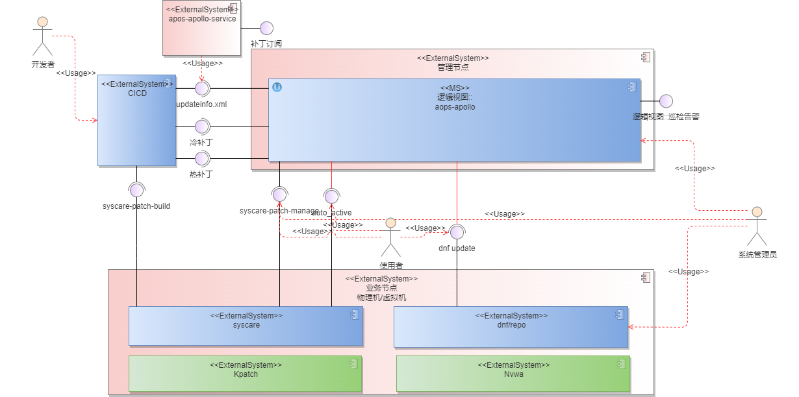
- apollo提供补丁制作组件，rpm和dnf插件模块，实现热补丁功能扩展。实现热补丁流水线，客户可使用rpm和dnf进行操作，实现独立使用和适配轻量化场景
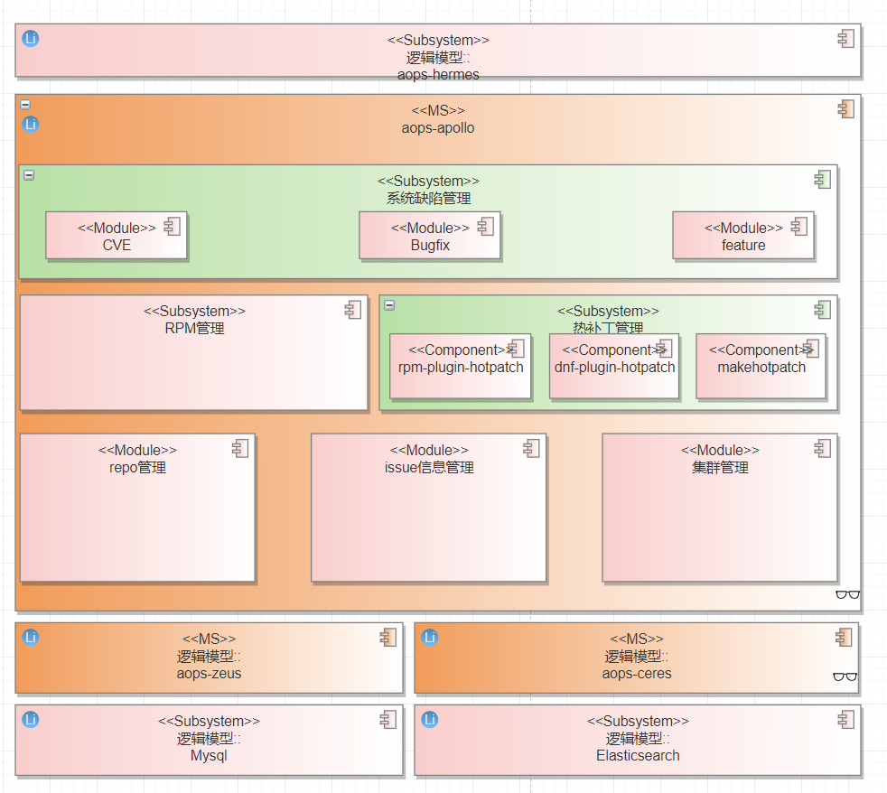

**需求如下**
  - [IR-apollo-hotmake]apollo-CICD流水线支持冷热补丁制作和发布
  - [IR-apollo-hotmakeinfo]apollo-支持CVE和Bugfix信息发布，并关联冷热补丁
  - [IR-apollo-issue_scanf]apollo-系统缺陷巡检
  - [IR-apollo-cold_fix]apollo-系统缺陷支持冷补丁修复
  - [IR-apollo-rpm-hot_fix]apollo-支持使用rpm管理热补丁
  - [IR-apollo-dnf-hot_fix]apollo-支持使用dnf管理热补丁
  - [IR-apollo-hot_fix]apollo-系统缺陷支持热补丁修复

### 2.1.1、支持CVE和Bugfix热补丁制作及信息发布，并关联冷热补丁
**包含IR清单**
|IR描述|
|:-----|
|[IR-apollo-hotmake]apollo-CICD流水线支持冷热补丁制作和发布（下半年交付，待分析）|
|[IR-apollo-hotmakeinfo]apollo-支持CVE和Bugfix信息发布，并关联冷热补丁|

- 热修复除了热补丁限制外，还需要解决无米之炊的问题，通过在CICD中集成热补丁流水线，实现依赖PR完成热补丁制作。除了热补丁交付件本身外，还在updateinfo.xml内嵌入热补丁信息，管理热补丁到CVE和bugfix的关系。本章节主要介绍信息管理，详细热补丁流程参考2.1.1
- apollo发布件新增热补丁制作工具集，主要包含1.热补丁制作管理，管理热补丁制作环境和提供对外接口；2.提供updateinfo.xml生成工具，根据传入的热补丁名称，PR描述（CVE和Bugfix信息）等，生成具备热补丁信息描述的updateinfo.xml（增量）
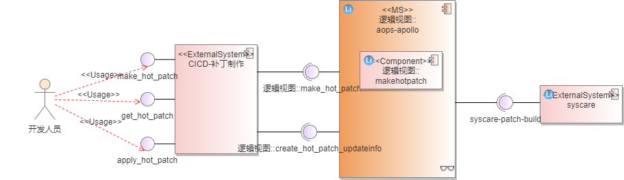

**需求如下**
  - [IR-apollo-hotmakeinfo][SR-hotmakeinfo-001]创建热补丁updateinfo.xml
  - [IR-apollo-hotmakeinfo][SR-hotmakeinfo-002]支持指定缺陷类型/ID/描述/严重等级/缺陷id等
    - 必选项：update-type，title，id，description，severity
    - 可选项：issued-date，update-status（默认stable）,issue链接地址，references-title（为空和title保持一致），reference-type（与update-type自动对应）
    - 其他信息根据热补丁包自动填充
    - 全局配置：update-from，release
  - [IR-apollo-hotmakeinfo][SR-hotmakeinfo-003]支持按照指定路径存储updateinfo.xml
  - [IR-apollo-hotmakeinfo][SR-hotmakeinfo-004]支持updateinfo与正式补丁包的正确性检测
    - 传入updateinfo.xml和热补丁包路径，检测热补丁是否真实存在，比较文件名和xml中描述是否一致

**CICD需求**
  - [CICD-hotmake][SR-hotmake-001]支持PR评论命令makehotpatch创建updateinfo.xml
    - PR合入后自动创建特定格式的热补丁issue
    - 准备热补丁制作环境：自动收集PR的代码，修改之前的二进制软件包信息
    - 提供制作环境下载功能和指导文档，供开发人员自验证
    - 提供开发，验证，发布流程（待详细设计）

**updateinfo.xml参考格式如下**
```xml
<?xml version="1.0" encoding="UTF-8"?>  
<updates>  
     <update from="openeuler.org" type="security/bugfix/feature" status="stable">  
          <id>openEuler-SA-2021-1502</id>  
          <title>An update for polkit is now available for openEuler-20.03-LTS-SP3</title>  
          <severity>Important</severity>  
          <release>openEuler</release>  
          <issued date="2022-01-27"></issued>  
          <references>  
               <reference href="https://nvd.nist.gov/vuln/detail/CVE-2021-4034" id="CVE-2021-4034" title="CVE-2021-4034" type="cve"></reference>  
          </references>
          <description>xxxxxxxxxxxxx</description>
          <pkglist>
               <collection>
                    <name>openEuler</name>
                    <package arch="aarch64/noarch/x86_64" name="polkit" release="9.oe1" version="0.116">
                         <filename>polkit-0.116-9.oe1.aarch64.rpm</filename>
                    </package>
               </collection>
			   //本次新增字段
			   <hot_patch_collection>
                    <name>openEuler</name>
                    <package arch="aarch64" name="polkit" release="9.oe1" version="0.116">
                         <filename>polkit-0.116-9.oe1.aarch64.rpm</filename>
                    </package>
                    <package arch="noarch" name="polkit-help" release="9.oe1" version="0.116">
                         <filename>polkit-help-0.116-9.oe1.noarch.rpm</filename>
                    </package>
			   </hot_patch_collection>
          </pkglist>
     </update>
</updates>
```

**接口清单**

补丁制作工具SystemHotpatch，提供热补丁制作和补丁信息生成功能，支持用户态和内核态热补丁生成

```
shp COMMAND [OPTIONS...]

List of main command：
build-hp                make hotpatch
build-info              make updateinfo.xml for hotpatch

General build-hp options：
  -n, --name <NAME>                      Patch name
      --version <VERSION>                Patch version [default: 1]
      --description <DESCRIPTION>        Patch description [default: None]
      --target-name <TARGET_NAME>        Patch target name
  -t, --target-elfname <TARGET_ELFNAME>  Patch target executable name
      --target-version <TARGET_VERSION>  Patch target version
      --target-release <TARGET_RELEASE>  Patch target release
      --target-license <TARGET_LICENSE>  Patch target license
  -s, --source <SOURCE>                  source package
  -d, --debuginfo <DEBUGINFO>            Debuginfo package
      --workdir <WORKDIR>                Working directory [default: .]
  -o, --output <OUTPUT>                  Generated patch output directory [default: .]
      --kjobs <N>                        Kernel make jobs [default: 32]
      --skip-compiler-check              Skip compiler version check (not recommended)
 
General build-info options:
  --type  <security/bugfix/feature>      Issue type
  --title <TITLE_INFo>                   Issue title
  --id    <ID_NUMBER>                    Issue id
  --description <DESCRIPTION>            Issue description
  --severity <Important/xxxx>            Issue severity
  --output                               Generatd updateinfo.xml output directory

```


### 2.1.2、系统缺陷支持热补丁修复

**包含IR清单**

|IR描述|
|:-----|
|[IR-apollo-rpm-hot_fix]apollo-支持使用rpm管理热补丁|
|[IR-apollo-dnf-hot_fix]apollo-支持使用dnf管理热补丁|
|[IR-apollo-hot_fix]apollo-系统缺陷支持热补丁修复|

- 热补丁最终制作成rpm，通过updateinfo提供与CVE和Bugfix的信息管理。集中通过repo的方式对外发布。
- 提供dnf-plugin-hotpatch使能dnf支持热补丁管理，提供热补丁下载，安装和升级操作。提供根据updateinfo升级热补丁操作，支持info，list，update，updateinfo list/info/summary，新增update --hotpatch接口。
  - update、list、info等
  - 🔥热补丁的rpm如果被update怎么处理？需要补充围绕rpm的冷热补丁流程图和状态图
- 对外提供CVE/Bugfix巡检、修复、回退和查询操作，通过集群管理模块提供集群巡检能力
- 需要支持在rpm信息中设置和查询热补丁标签？

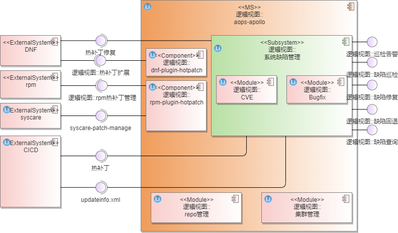

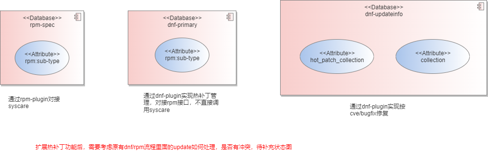


**接口清单**

- DNF支持热补丁

  相关命令需要对热补丁依赖，是否已经激活热补丁做判断，以便热补丁正常生效

```
dnf updateinfo
Updates Information Summary: available
    184 Security notice(s)
         23 Critical Security notice(s)
         96 Important Security notice(s)
         62 Moderate Security notice(s)
          3 Low Security notice(s)
Hotpatch Infomation Summary: available
    xxx Security notice(s)
         xx Critical Security notice(s)
         xx Important Security notice(s)
         xx Moderate Security notice(s)
          x Low Security notice(s)
  
dnf COMMAND [OPTIONS...]

List of main command：
  hot-info                Hot patch summary info
  hot-list                Hot patch list
  hot-upgrade             Hot patch upgrade
  hot-remove              Hot patch remove
General DNF options:
  --downloadonly          only download hotpatch
  --load                  Load hotpatch into system
  --active                Active hotpatch
  --deactive              Deactive hotpatch
  --security              Include security relevant hotpatchs, in updates
  --advisory ADVISORY     Include hotpatchs needed to fix the given advisory, in updates
  --cve CVES              Include hotpatchs needed to fix the given CVE, in updates
  --sec-severity {Critical,Important,Moderate,Low} Include security relevant hotpatchs matching the severity, in updates
  --bz BUGZILLA           Include hotpatchs needed to fix the given BZ, in updates
  -h,--help               Help info of hotpatch

```

  

**待分析内容**

|NO|分析项|责任人|预计完成时间|分析结论|
|:--|:----|:-----|:----------|:------|
|1|spec如何新增标签\<rpm:sub-type>hotpatch</rpm:sub-type>,如何新增到primary.xml中|text|text|text|
|2|rpm插件开发指导|text|text|text|
|3|updateinfo中新增hot_patch_collection对已有流程是否有影响|text|text|text|
|4|dnf插件开发指导|text|text|text|
|5|rpm扩展热补丁后，对原有升级流程影响和状态图分析|胡峰|2023-2-8|text|


**参考信息**
- suse对metadata的定义https://en.opensuse.org/openSUSE:Standards_Rpm_Metadata


---------------

### 2.1.1、cve扫描Use Case

- 当配置好相应的repo源后，执行一种指定的cve扫描方式（如根据openEuler的安全公告来识别当前管理主机已安装软件包的cve信息），即可获取到某指定主机的cve信息。
- 可以识别出用户需要的功能为：
  - 安全公告导入，首先需要一份全量cve信息数据库，后续才能关联这些信息。
  - cve扫描，这里涉及到扫描任务的管理（创建、执行、进度查询、结果查看）。
  - 扫描报告导出，方便用户查看更详细的信息。

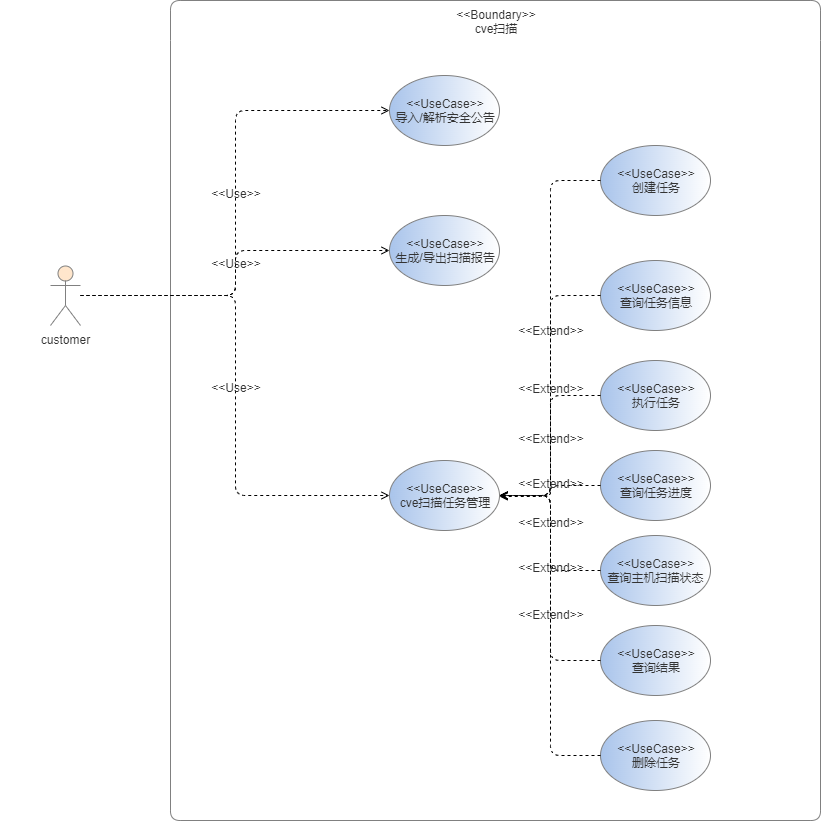

### 2.1.3、cve信息查询Use Case

- 扫描出来的信息需要清晰直观地呈现给用户，因此要提供给用户一个查询的界面。并且在上面能够做一些筛选和评审。
- 可以识别出用户需要的功能为：
  - cve信息查询，包括cve信息总览、cve列表、cve详情等
  - 主机维度查询，获取主机列表，获取主机的cve信息等。
  - cve评审状态设置，用户可已设置cve状态，如标志某cve已review，或可忽略。

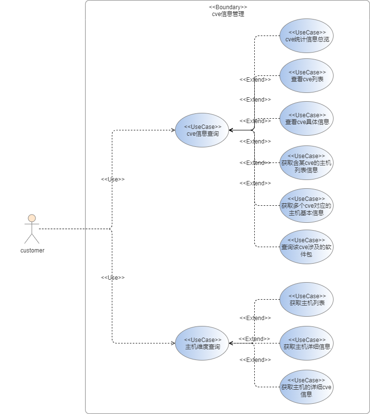

### 2.1.4、cve修复Use Case

- 当用户完成cve扫描、评审后，需要对识别出来cve的主机进行修复，后端通过aops的管理组件下发命令到agent端的方式来执行修复任务，同时需要支持cve修复回滚。

- 可以识别出用户需要的功能为：

  - cve修复任务管理，如执行cve扫描，查看cve修复任务的详情，查询具体某个cve的进度，状态查询，结果查询，执行cve修复回滚等。

  - cve修复回滚，当修复后存在问题时，需要及时回滚。


### 2.1.1、repo设置Use Case

- 要完成cve管理首先需要update repo源的管理，基于openEuler的安全策略：cve在修复后会以安全公告以及update版本的形式对外发布，所以这里需要用户配置openEuler对应版本的update repo源，随后才能通过yum命令获取到当前节点存在的cve信息，以及做进一步的cve修复操作。

- 可以识别出用户需要的功能为：

  - repo源管理，用户能够查看、添加、更新、删除其名下的repo源。

  - 配置repo源，用户可以选择给指定的主机配置指定的repo源，这里涉及到任务的管理。

  - 下载repo源模板，为方便用户添加repo，专门提供了repo模板。

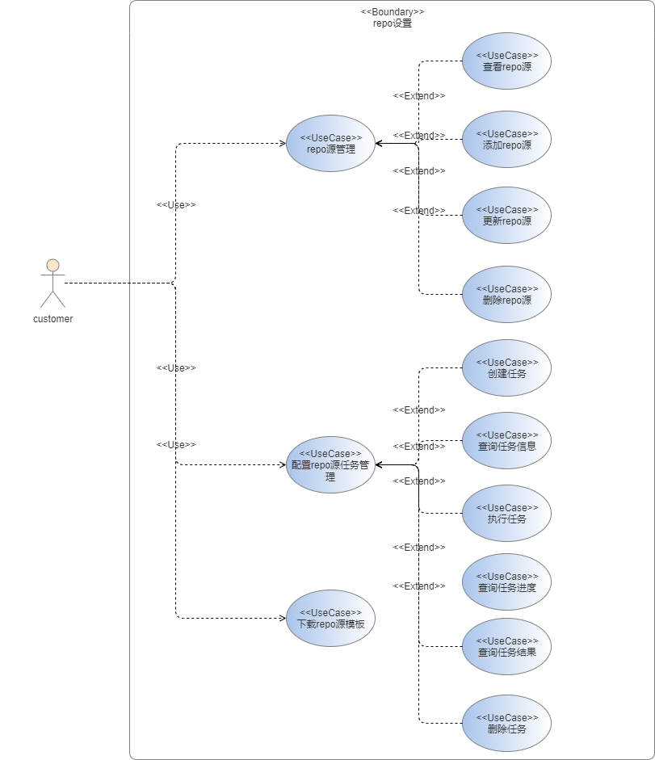


## 2.2、Story分解

| Use Case    | Story                                    | 模块         | 实现版本  | 说明                                 |
| ----------- | ---------------------------------------- | ------------ | --------- | ------------------------------------ |
| repo设置    | 查看repo源                               | repo信息管理 | 22.03     |                                      |
|             | 添加repo源                               | repo信息管理 | 22.03     |                                      |
|             | 更新repo源                               | repo信息管理 | 22.03     |                                      |
|             | 删除repo源                               | repo信息管理 | 22.03     |                                      |
|             | 创建配置repo源任务                       | 任务管理     | **22.12** | 不再需要pb                           |
|             | 查询配置repo源任务                       | 任务管理     | 22.03     |                                      |
|             | 执行配置repo源任务                       | 任务管理     | **22.12** | 由ansible的执行方式修改为agent端执行 |
|             | 查询配置repo源任务进度                   | 任务管理     | 22.03     |                                      |
|             | 查询配置repo源任务结果                   | 任务管理     | 22.03     |                                      |
|             | 删除配置repo源任务                       | 任务管理     | 22.03     |                                      |
|             | 下载repo源模板                           | repo信息管理 | 22.03     |                                      |
| cve扫描     | 导入/解析安全公告                        | cve信息管理  | **22.12** | 支持解析不受影响cve                  |
|             | 创建cve扫描任务                          | 任务管理     | **22.12** | 显式创建cve扫描任务，并存储任务信息  |
|             | 查询cve扫描任务                          | 任务管理     | **22.12** | 查询cve扫描任务详情，扩展task_type   |
|             | 执行cve扫描任务                          | 任务管理     | **22.12** | 由ansible的执行方式修改为agent端执行 |
|             | 查询cve扫描任务进度                      | 任务管理     | **22.12** | 任务进度查询扩展（支持cve_scan）     |
|             | 查询cve扫描结果                          | 任务管理     | **22.12** |                                      |
|             | 生成/导出扫描报告                        | cve信息管理  | **22.12** |                                      |
|             | 查询主机的扫描状态                       | 任务管理     | 22.03     |                                      |
|             | 删除cve扫描任务                          | 任务管理     | 22.03     |                                      |
| cve信息查询 | cve统计信息总览                          | cve信息管理  | 22.03     |                                      |
|             | 查看cve列表                              | cve信息管理  | 22.03     |                                      |
|             | 查看cve具体信息                          | cve信息管理  | 22.03     |                                      |
|             | 获取某cve主机相关详细信息                | cve信息管理  | 22.03     |                                      |
|             | 获取多个cve对应的主机基本信息            | cve信息管理  | 22.03     |                                      |
|             | 设置cve评审状态                          | cve信息管理  | 22.03     |                                      |
|             | 查询修复cve后的一系列操作                | cve信息管理  | 22.03     |                                      |
|             | 获取主机列表                             | cve信息管理  | 22.03     |                                      |
|             | 获取主机详细信息（基础信息+cve数量统计） | cve信息管理  | 22.03     |                                      |
|             | 获取指定主机的详细cve信息                | cve信息管理  | **22.12** | 支持筛选不受影响cve                  |
| cve修复     | 创建cve修复任务                          | 任务管理     | **22.12** | 不再需要pb                           |
|             | 查询cve修复任务详情                      | 任务管理     | 22.03     |                                      |
|             | 执行cve修复任务                          | 任务管理     | **22.12** | 由ansible的执行方式修改为agent端执行 |
|             | 查询cve修复任务进度                      | 任务管理     | 22.03     |                                      |
|             | 查询cve修复任务主机的状态                | 任务管理     | 22.03     |                                      |
|             | 查询cve修复任务结果                      | 任务管理     | 22.03     |                                      |
|             | 删除cve修复任务                          | 任务管理     | 22.03     |                                      |
|             | 回滚cve修复                              | 任务管理     |           |                                      |


# 3、模块设计

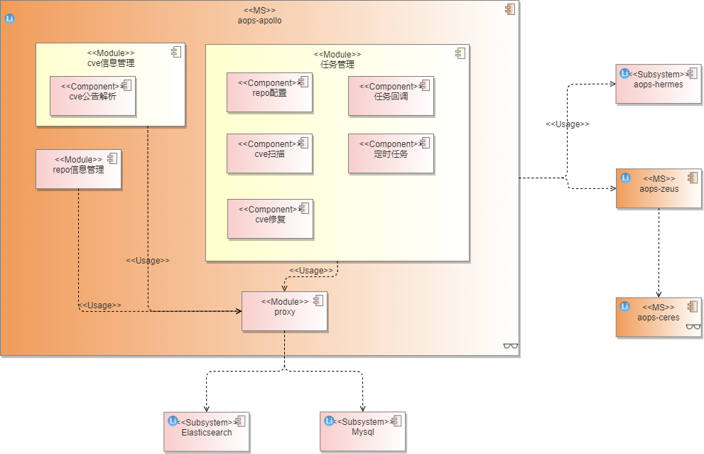

- API

  cve管理服务对外提供restful api接口，可结合配套的aops-hermes使用，其提供了web操作界面。

- 服务层

  主要功能分为三个模块，分别是cve信息管理模块、repo信息管理模块、任务管理模块，其中：

  - 负责cve信息的不同维度的统计，cve状态的修改，安全公告解析；

  - repo管理模块负责update repo源的增删改查管理，提供了repo源的模板下载；

  - 任务管理模块负责cve扫描、修复、回滚、repo配置等任务的生成，任务中间状态的存储与查询，任务执行，以及定时任务（cve扫描、cve安全公告解析）的执行。

- 依赖服务/库

  该服务依赖于其他服务/库提供的功能，主要是aops-zeus，aops-ceres，aops-vulcanus，其中：

  - aops-zeus服务为aops的管理服务，提供基本的主机管理功能，为该服务提供主机ip等基本信息，并提供命令下发通道；
  - aops-ceres服务部署在客户端侧，提供cve修复需要的系列命令执行功能，如执行cve的修复命令（yum update --cve=xxx）；
  - aops-vulcanus为aops的工具库，提供了配置解析、日志管理、response封装等常用工具库。
  
- 数据库

  该软件依赖于两个数据库，分别为elasticsearch和mysql，其中：

  - elasticsearch存储复杂的cve软件包信息以及修复日志信息；

  - mysql存储cve与主机的关系信息、任务的基础信息。

## 3.1、repo信息管理

### 3.1.1、repo源模板下载

提供repo源模板下载，方便用户直接在模板上编写后提交

```shell
[update]
name=update
baseurl=http://repo.openeuler.org/openEuler-22.03/update/$basearch
enabled=1
```

## 3.2、cve信息管理

### 3.2.1、cve信息导入/解析

cve修复信息来自于安全公告与不受影响cve信息，需要在界面上导入，做一定解析后存入数据库中。

#### 3.2.1.1、安全公告

- 安全公告提供了已修复的cve信息，当前支持文件格式：
  - zip，为xml的合集
  - xml
- 安全公告格式如下：

```xml
<?xml version="1.0" encoding="UTF-8"?>
<cvrfdoc xmlns="http://www.icasi.org/CVRF/schema/cvrf/1.1" xmlns:cvrf="http://www.icasi.org/CVRF/schema/cvrf/1.1">
	<DocumentTitle xml:lang="en">An update for python-lxml is now available for openEuler-20.03-LTS-SP1 and openEuler-20.03-LTS-SP2 and openEuler-20.03-LTS-SP3</DocumentTitle>
	<DocumentType>Security Advisory</DocumentType>
	<DocumentNotes>
		<Note Title="Synopsis" Type="General" Ordinal="1" xml:lang="en">python-lxml security update</Note>
		<Note Title="Summary" Type="General" Ordinal="2" xml:lang="en">An update for python-lxml is now available for openEuler-20.03-LTS-SP1 and openEuler-20.03-LTS-SP2 and openEuler-20.03-LTS-SP3.</Note>
		<Note Title="Description" Type="General" Ordinal="3" xml:lang="en">XML processing library combining libxml2/libxslt with the ElementTree API.

Security Fix(es):

lxml is a library for processing XML and HTML in the Python language. Prior to version 4.6.5, the HTML Cleaner in lxml.html lets certain crafted script content pass through, as well as script content in SVG files embedded using data URIs. Users that employ the HTML cleaner in a security relevant context should upgrade to lxml 4.6.5 to receive a patch. There are no known workarounds available.(CVE-2021-43818)</Note>
		<Note Title="Topic" Type="General" Ordinal="4" xml:lang="en">An update for python-lxml is now available for openEuler-20.03-LTS-SP1 and openEuler-20.03-LTS-SP2 and openEuler-20.03-LTS-SP3.

openEuler Security has rated this update as having a security impact of high. A Common Vunlnerability Scoring System(CVSS)base score,which gives a detailed severity rating, is available for each vulnerability from the CVElink(s) in the References section.</Note>
		<Note Title="Severity" Type="General" Ordinal="5" xml:lang="en">High</Note>
		<Note Title="Affected Component" Type="General" Ordinal="6" xml:lang="en">python-lxml</Note>
	</DocumentNotes>
	<ProductTree xmlns="http://www.icasi.org/CVRF/schema/prod/1.1">
		<Branch Type="Product Name" Name="openEuler">
			<FullProductName ProductID="openEuler-20.03-LTS-SP1" CPE="cpe:/a:openEuler:openEuler:20.03-LTS-SP1">openEuler-20.03-LTS-SP1</FullProductName>
			<FullProductName ProductID="openEuler-20.03-LTS-SP2" CPE="cpe:/a:openEuler:openEuler:20.03-LTS-SP2">openEuler-20.03-LTS-SP2</FullProductName>
			<FullProductName ProductID="openEuler-20.03-LTS-SP3" CPE="cpe:/a:openEuler:openEuler:20.03-LTS-SP3">openEuler-20.03-LTS-SP3</FullProductName>
		</Branch>
		<Branch Type="Package Arch" Name="aarch64">
			<FullProductName ProductID="python-lxml-debuginfo-4.5.2-4" CPE="cpe:/a:openEuler:openEuler:20.03-LTS-SP1">python-lxml-debuginfo-4.5.2-4.oe1.aarch64.rpm</FullProductName>
			<FullProductName ProductID="python3-lxml-4.5.2-4" CPE="cpe:/a:openEuler:openEuler:20.03-LTS-SP1">python3-lxml-4.5.2-4.oe1.aarch64.rpm</FullProductName>
			<FullProductName ProductID="python-lxml-debugsource-4.5.2-4" CPE="cpe:/a:openEuler:openEuler:20.03-LTS-SP1">python-lxml-debugsource-4.5.2-4.oe1.aarch64.rpm</FullProductName>
			<FullProductName ProductID="python2-lxml-4.5.2-4" CPE="cpe:/a:openEuler:openEuler:20.03-LTS-SP1">python2-lxml-4.5.2-4.oe1.aarch64.rpm</FullProductName>
			<FullProductName ProductID="python2-lxml-4.5.2-4" CPE="cpe:/a:openEuler:openEuler:20.03-LTS-SP2">python2-lxml-4.5.2-4.oe1.aarch64.rpm</FullProductName>
			<FullProductName ProductID="python-lxml-debugsource-4.5.2-4" CPE="cpe:/a:openEuler:openEuler:20.03-LTS-SP2">python-lxml-debugsource-4.5.2-4.oe1.aarch64.rpm</FullProductName>
			<FullProductName ProductID="python-lxml-debuginfo-4.5.2-4" CPE="cpe:/a:openEuler:openEuler:20.03-LTS-SP2">python-lxml-debuginfo-4.5.2-4.oe1.aarch64.rpm</FullProductName>
			<FullProductName ProductID="python3-lxml-4.5.2-4" CPE="cpe:/a:openEuler:openEuler:20.03-LTS-SP2">python3-lxml-4.5.2-4.oe1.aarch64.rpm</FullProductName>			
			<FullProductName ProductID="python2-lxml-4.5.2-4" CPE="cpe:/a:openEuler:openEuler:20.03-LTS-SP3">python2-lxml-4.5.2-4.oe1.aarch64.rpm</FullProductName>
			<FullProductName ProductID="python-lxml-debugsource-4.5.2-4" CPE="cpe:/a:openEuler:openEuler:20.03-LTS-SP3">python-lxml-debugsource-4.5.2-4.oe1.aarch64.rpm</FullProductName>
			<FullProductName ProductID="python-lxml-debuginfo-4.5.2-4" CPE="cpe:/a:openEuler:openEuler:20.03-LTS-SP3">python-lxml-debuginfo-4.5.2-4.oe1.aarch64.rpm</FullProductName>
			<FullProductName ProductID="python3-lxml-4.5.2-4" CPE="cpe:/a:openEuler:openEuler:20.03-LTS-SP3">python3-lxml-4.5.2-4.oe1.aarch64.rpm</FullProductName>
		</Branch>
		<Branch Type="Package Arch" Name="noarch">
			<FullProductName ProductID="python-lxml-help-4.5.2-4" CPE="cpe:/a:openEuler:openEuler:20.03-LTS-SP1">python-lxml-help-4.5.2-4.oe1.noarch.rpm</FullProductName>
			<FullProductName ProductID="python-lxml-help-4.5.2-4" CPE="cpe:/a:openEuler:openEuler:20.03-LTS-SP2">python-lxml-help-4.5.2-4.oe1.noarch.rpm</FullProductName>
			<FullProductName ProductID="python-lxml-help-4.5.2-4" CPE="cpe:/a:openEuler:openEuler:20.03-LTS-SP3">python-lxml-help-4.5.2-4.oe1.noarch.rpm</FullProductName>
		</Branch>
		<Branch Type="Package Arch" Name="src">
			<FullProductName ProductID="python-lxml-4.5.2-4" CPE="cpe:/a:openEuler:openEuler:20.03-LTS-SP1">python-lxml-4.5.2-4.oe1.src.rpm</FullProductName>
			<FullProductName ProductID="python-lxml-4.5.2-4" CPE="cpe:/a:openEuler:openEuler:20.03-LTS-SP2">python-lxml-4.5.2-4.oe1.src.rpm</FullProductName>
			<FullProductName ProductID="python-lxml-4.5.2-4" CPE="cpe:/a:openEuler:openEuler:20.03-LTS-SP3">python-lxml-4.5.2-4.oe1.src.rpm</FullProductName>
		</Branch>
		<Branch Type="Package Arch" Name="x86_64">
			<FullProductName ProductID="python-lxml-debuginfo-4.5.2-4" CPE="cpe:/a:openEuler:openEuler:20.03-LTS-SP1">python-lxml-debuginfo-4.5.2-4.oe1.x86_64.rpm</FullProductName>
			<FullProductName ProductID="python2-lxml-4.5.2-4" CPE="cpe:/a:openEuler:openEuler:20.03-LTS-SP1">python2-lxml-4.5.2-4.oe1.x86_64.rpm</FullProductName>
			<FullProductName ProductID="python3-lxml-4.5.2-4" CPE="cpe:/a:openEuler:openEuler:20.03-LTS-SP1">python3-lxml-4.5.2-4.oe1.x86_64.rpm</FullProductName>
			<FullProductName ProductID="python-lxml-debugsource-4.5.2-4" CPE="cpe:/a:openEuler:openEuler:20.03-LTS-SP1">python-lxml-debugsource-4.5.2-4.oe1.x86_64.rpm</FullProductName>
			<FullProductName ProductID="python-lxml-debuginfo-4.5.2-4" CPE="cpe:/a:openEuler:openEuler:20.03-LTS-SP2">python-lxml-debuginfo-4.5.2-4.oe1.x86_64.rpm</FullProductName>
			<FullProductName ProductID="python3-lxml-4.5.2-4" CPE="cpe:/a:openEuler:openEuler:20.03-LTS-SP2">python3-lxml-4.5.2-4.oe1.x86_64.rpm</FullProductName>
			<FullProductName ProductID="python-lxml-debugsource-4.5.2-4" CPE="cpe:/a:openEuler:openEuler:20.03-LTS-SP2">python-lxml-debugsource-4.5.2-4.oe1.x86_64.rpm</FullProductName>
			<FullProductName ProductID="python2-lxml-4.5.2-4" CPE="cpe:/a:openEuler:openEuler:20.03-LTS-SP2">python2-lxml-4.5.2-4.oe1.x86_64.rpm</FullProductName>
			<FullProductName ProductID="python-lxml-debuginfo-4.5.2-4" CPE="cpe:/a:openEuler:openEuler:20.03-LTS-SP3">python-lxml-debuginfo-4.5.2-4.oe1.x86_64.rpm</FullProductName>
			<FullProductName ProductID="python3-lxml-4.5.2-4" CPE="cpe:/a:openEuler:openEuler:20.03-LTS-SP3">python3-lxml-4.5.2-4.oe1.x86_64.rpm</FullProductName>
			<FullProductName ProductID="python-lxml-debugsource-4.5.2-4" CPE="cpe:/a:openEuler:openEuler:20.03-LTS-SP3">python-lxml-debugsource-4.5.2-4.oe1.x86_64.rpm</FullProductName>
			<FullProductName ProductID="python2-lxml-4.5.2-4" CPE="cpe:/a:openEuler:openEuler:20.03-LTS-SP3">python2-lxml-4.5.2-4.oe1.x86_64.rpm</FullProductName>
		</Branch>
	</ProductTree>
	<Vulnerability Ordinal="1" xmlns="http://www.icasi.org/CVRF/schema/vuln/1.1">
		<Notes>
			<Note Title="Vulnerability Description" Type="General" Ordinal="1" xml:lang="en">lxml is a library for processing XML and HTML in the Python language. Prior to version 4.6.5, the HTML Cleaner in lxml.html lets certain crafted script content pass through, as well as script content in SVG files embedded using data URIs. Users that employ the HTML cleaner in a security relevant context should upgrade to lxml 4.6.5 to receive a patch. There are no known workarounds available.</Note>
		</Notes>
		<ReleaseDate>2022-01-07</ReleaseDate>
		<CVE>CVE-2021-43818</CVE>
		<ProductStatuses>
			<Status Type="Fixed">
				<ProductID>openEuler-20.03-LTS-SP1</ProductID>
				<ProductID>openEuler-20.03-LTS-SP2</ProductID>
				<ProductID>openEuler-20.03-LTS-SP3</ProductID>
			</Status>
		</ProductStatuses>
		<Threats>
			<Threat Type="Impact">
				<Description>High</Description>
			</Threat>
		</Threats>
		<CVSSScoreSets>
			<ScoreSet>
				<BaseScore>7.1</BaseScore>
				<Vector>AV:N/AC:L/PR:N/UI:R/S:C/C:L/I:L/A:L</Vector>
			</ScoreSet>
		</CVSSScoreSets>
		<Remediations>
			<Remediation Type="Vendor Fix">
				<Description>python-lxml security update</Description>
				<DATE>2022-01-07</DATE>
				<URL>https://www.openeuler.org/en/security/safety-bulletin/detail.html?id=openEuler-SA-2022-1482</URL>
			</Remediation>
		</Remediations>
	</Vulnerability>
</cvrfdoc>
```

#### 3.3.1.2、不受影响cve信息

- 不受影响cve信息的文件格式（xml）如下：

```xml
<?xml version="1.0" encoding="UTF-8"?>
<cvrfdoc xmlns="http://www.icasi.org/CVRF/schema/cvrf/1.1" xmlns:cvrf="http://www.icasi.org/CVRF/schema/cvrf/1.1">
	<Vulnerability Ordinal="1" xmlns="http://www.icasi.org/CVRF/schema/vuln/1.1">
		<Notes>
			<Note Title="Vulnerability Description" Type="General" Ordinal="1" xml:lang="en">A flaw was found in OpenEXR s hufDecode functionality. This flaw allows an attacker who can pass a crafted file to be processed by OpenEXR, to trigger an undefined right shift error. The highest threat from this vulnerability is to system availability.</Note>
		</Notes>
		<CVE>CVE-2021-20304</CVE>
		<ProductStatuses>
			<Status Type="Unaffected">
				<ProductID>openEuler-22.03-LTS</ProductID>
			</Status>
		</ProductStatuses>
		<CVSSScoreSets>
			<ScoreSet>
				<BaseScore>5.3</BaseScore>
				<Vector>AV:N/AC:L/PR:N/UI:N/S:U/C:N/I:N/A:L</Vector>
			</ScoreSet>
		</CVSSScoreSets>
		<Remediations>
			<Remediation Type="Unaffected">
				<Description>OpenEXR</Description>
				<DATE>2022-08-29</DATE>
				<ProductID>openEuler-22.03-LTS</ProductID>
			</Remediation>
		</Remediations>
	</Vulnerability>
	<Vulnerability Ordinal="2" xmlns="http://www.icasi.org/CVRF/schema/vuln/1.1">
		<Notes>
			<Note Title="Vulnerability Description" Type="General" Ordinal="2" xml:lang="en">The command-line argument parser in tcpdump before 4.99.0 has a buffer overflow in tcpdump.c:read_infile(). To trigger this vulnerability the attacker needs to create a 4GB file on the local filesystem and to specify the file name as the value of the -F command-line argument of tcpdump.</Note>
		</Notes>
		<CVE>CVE-2018-16301</CVE>
		<ProductStatuses>
			<Status Type="Unaffected">
				<ProductID>openEuler-22.03-LTS</ProductID>
			</Status>
		</ProductStatuses>
		<CVSSScoreSets>
			<ScoreSet>
				<BaseScore>7.8</BaseScore>
				<Vector>AV:L/AC:L/PR:N/UI:R/S:U/C:H/I:H/A:H</Vector>
			</ScoreSet>
		</CVSSScoreSets>
		<Remediations>
			<Remediation Type="Unaffected">
				<Description>tcpdump</Description>
				<DATE>2022-08-29</DATE>
				<ProductID>openEuler-22.03-LTS</ProductID>
			</Remediation>
		</Remediations>
	</Vulnerability>
	<Vulnerability Ordinal="3" xmlns="http://www.icasi.org/CVRF/schema/vuln/1.1">
		<Notes>
			<Note Title="Vulnerability Description" Type="General" Ordinal="3" xml:lang="en">No description is available for this CVE.</Note>
		</Notes>
		<CVE>CVE-2021-23980</CVE>
		<ProductStatuses>
			<Status Type="Unaffected">
				<ProductID>openEuler-20.03-LTS-SP1</ProductID>
				<ProductID>openEuler-20.03-LTS-SP3</ProductID>
			</Status>
		</ProductStatuses>
		<CVSSScoreSets>
			<ScoreSet>
				<BaseScore>6.1</BaseScore>
				<Vector>AV:N/AC:L/PR:N/UI:R/S:C/C:L/I:L/A:N</Vector>
			</ScoreSet>
		</CVSSScoreSets>
		<Remediations>
			<Remediation Type="Unaffected">
				<Description>python-bleach</Description>
				<DATE>2022-08-29</DATE>
				<ProductID>openEuler-20.03-LTS-SP1</ProductID>
			</Remediation>
			<Remediation Type="Unaffected">
				<Description>python-bleach</Description>
				<DATE>2022-08-29</DATE>
				<ProductID>openEuler-20.03-LTS-SP3</ProductID>
			</Remediation>
		</Remediations>
	</Vulnerability>
	<Vulnerability Ordinal="4" xmlns="http://www.icasi.org/CVRF/schema/vuln/1.1">
		<Notes>
			<Note Title="Vulnerability Description" Type="General" Ordinal="4" xml:lang="en">Use after free in garbage collector and finalizer of lgc.c in Lua interpreter 5.4.0~5.4.3 allows attackers to perform Sandbox Escape via a crafted script file.</Note>
		</Notes>
		<CVE>CVE-2021-44964</CVE>
		<ProductStatuses>
			<Status Type="Unaffected">
				<ProductID>openEuler-20.03-LTS-SP1</ProductID>
				<ProductID>openEuler-20.03-LTS-SP3</ProductID>
			</Status>
		</ProductStatuses>
		<CVSSScoreSets>
			<ScoreSet>
				<BaseScore>6.3</BaseScore>
				<Vector>AV:L/AC:L/PR:N/UI:R/S:C/C:N/I:N/A:H</Vector>
			</ScoreSet>
		</CVSSScoreSets>
		<Remediations>
			<Remediation Type="Unaffected">
				<Description>lua</Description>
				<DATE>2022-08-29</DATE>
				<ProductID>openEuler-20.03-LTS-SP1</ProductID>
			</Remediation>
			<Remediation Type="Unaffected">
				<Description>lua</Description>
				<DATE>2022-08-29</DATE>
				<ProductID>openEuler-20.03-LTS-SP3</ProductID>
			</Remediation>
		</Remediations>
	</Vulnerability>
	<Vulnerability Ordinal="5" xmlns="http://www.icasi.org/CVRF/schema/vuln/1.1">
		<Notes>
			<Note Title="Vulnerability Description" Type="General" Ordinal="5" xml:lang="en">A double-free condition exists in contrib/shpsort.c of shapelib 1.5.0 and older releases. This issue may allow an attacker to cause a denial of service or have other unspecified impact via control over malloc.</Note>
		</Notes>
		<CVE>CVE-2022-0699</CVE>
		<ProductStatuses>
			<Status Type="Unaffected">
				<ProductID>openEuler-20.03-LTS-SP1</ProductID>
				<ProductID>openEuler-20.03-LTS-SP3</ProductID>
			</Status>
		</ProductStatuses>
		<CVSSScoreSets>
			<ScoreSet>
				<BaseScore>5</BaseScore>
				<Vector>AV:N/AC:L/Au:N/C:P/I:N/A:N</Vector>
			</ScoreSet>
		</CVSSScoreSets>
		<Remediations>
			<Remediation Type="Unaffected">
				<Description>shapelib</Description>
				<DATE>2022-08-29</DATE>
				<ProductID>openEuler-20.03-LTS-SP1</ProductID>
			</Remediation>
			<Remediation Type="Unaffected">
				<Description>shapelib</Description>
				<DATE>2022-08-29</DATE>
				<ProductID>openEuler-20.03-LTS-SP3</ProductID>
			</Remediation>
		</Remediations>
	</Vulnerability>
	<Vulnerability Ordinal="6" xmlns="http://www.icasi.org/CVRF/schema/vuln/1.1">
		<Notes>
			<Note Title="Vulnerability Description" Type="General" Ordinal="6" xml:lang="en">Improper Input Validation vulnerability in HTTP/2 header parsing of Apache Traffic Server allows an attacker to smuggle requests. This issue affects Apache Traffic Server 8.0.0 to 9.1.2.</Note>
		</Notes>
		<CVE>CVE-2022-31779</CVE>
		<ProductStatuses>
			<Status Type="Unaffected">
				<ProductID>openEuler-22.03-LTS</ProductID>
			</Status>
		</ProductStatuses>
		<CVSSScoreSets>
			<ScoreSet>
				<BaseScore>7.5</BaseScore>
				<Vector>AV:N/AC:L/PR:N/UI:N/S:U/C:N/I:H/A:N</Vector>
			</ScoreSet>
		</CVSSScoreSets>
		<Remediations>
			<Remediation Type="Unaffected">
				<Description>trafficserver</Description>
				<DATE>2022-08-29</DATE>
				<ProductID>openEuler-22.03-LTS</ProductID>
			</Remediation>
		</Remediations>
	</Vulnerability>
	<Vulnerability Ordinal="7" xmlns="http://www.icasi.org/CVRF/schema/vuln/1.1">
		<Notes>
			<Note Title="Vulnerability Description" Type="General" Ordinal="7" xml:lang="en">In Varnish Cache 7.0.0, 7.0.1, 7.0.2, and 7.1.0, it is possible to cause the Varnish Server to assert and automatically restart through forged HTTP/1 backend responses. An attack uses a crafted reason phrase of the backend response status line. This is fixed in 7.0.3 and 7.1.1.</Note>
		</Notes>
		<CVE>CVE-2022-38150</CVE>
		<ProductStatuses>
			<Status Type="Unaffected">
				<ProductID>openEuler-20.03-LTS-SP1</ProductID>
				<ProductID>openEuler-20.03-LTS-SP3</ProductID>
			</Status>
		</ProductStatuses>
		<CVSSScoreSets>
			<ScoreSet>
				<BaseScore>7.5</BaseScore>
				<Vector>AV:N/AC:L/PR:N/UI:N/S:U/C:N/I:N/A:H</Vector>
			</ScoreSet>
		</CVSSScoreSets>
		<Remediations>
			<Remediation Type="Unaffected">
				<Description>varnish</Description>
				<DATE>2022-08-29</DATE>
				<ProductID>openEuler-20.03-LTS-SP1</ProductID>
			</Remediation>
			<Remediation Type="Unaffected">
				<Description>varnish</Description>
				<DATE>2022-08-29</DATE>
				<ProductID>openEuler-20.03-LTS-SP3</ProductID>
			</Remediation>
		</Remediations>
	</Vulnerability>
</cvrfdoc>
```

- 解析后cve的评分、严重程度、发布时间等存入mysql中，cve的描述信息存入elasticsearch，其格式如下：

```json
index:cve_pkg

{
    "cve_id": "",
    "description": ""
}
```

### 3.2.2、cve信息导出


### 3.2.3、cve评审状态设置

支持用户修改cve状态，目前支持状态为：

- not reviewed（未关注）
- in review（关注中）
- on-hold（挂起）
- resolved（已解决）
- no action（已忽略）

## 3.3、任务管理

任务管理模块提供功能：repo源设置、cve扫描、cve修复等任务的创建、任务进度查询/回调功能

- 任务管理定义了一套规范，由manager控制：
  - 任务创建（create_task）
  - 前置操作（pre_handle），主要是数据库里一些相应状态的修改，
  - 任务执行（handle），这里的任务执行主要通过向aops-zeus发送restful请求进行，aops-zeus校验后会再向客户端发送命令执行请求。
  - 回调（callback），为实时反馈任务进度，restful请求中带了回调函数地址，每当一个子任务完成，会通过回调函数实时更新任务状态。
  - 任务后置处理（post_handle），主要将任务结果经过处理后刷新到数据库中。
  - 错误处理（fault_handle），为防止网络原因等问题导致任务进度刷新失败、任务执行失败等，需要再将数据库中的状态刷新。

- 流程图

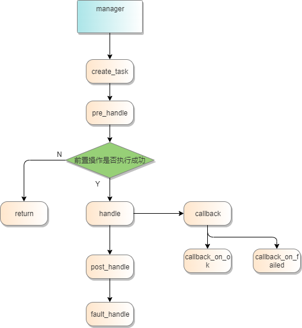

- 时序图

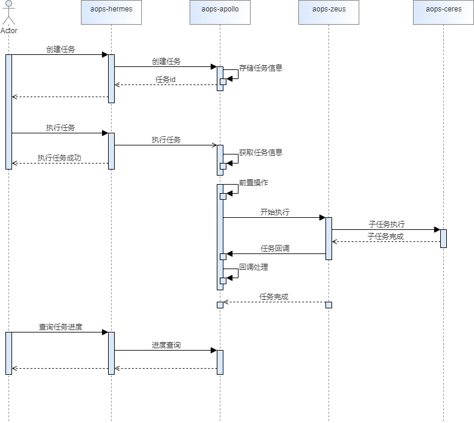

#### 3.3.1、repo源设置

- create_task
  
  - 将任务信息存入数据库，该任务主要是将repo源下发到客户端指定路径
  
  - 生成任务信息（与aops-ceres服务约定任务模板）
  
    ```json
    {
        "task_id": "1",
        "task_name": "",
        "task_type": "repo set",
        "total_hosts": ["id1", "id2"],
        // 一些预置检查需要，如检查网络等，当检查失败时，停止执行任务
        "check_items": [],
        "repo_info": {
            // repo名称
            "name": "",
            // 存放路径
            "dest": "/etc/yum.repos.d/aops-update.repo",
            // repo内容，以字符串形式呈现
            "repo_content": ""
        },
        "tasks": [
            {
                "host_id": "id1",
                // 是否执行预置检查
                "check": false
            },
            {
                "host_id": "id2",
                "check": false
            }
        ],
        "callback": "/vulnerability/task/callback/repo/set"
    }
    ```
  
- pre_handle
  
  - 更新repo设置任务的状态为`running`
  - 更新任务执行时间为当前时间
  
- handle

  - 向aops-zeus发送restful请求
  - 回调函数地址：/vulnerability/task/callback/repo/set

- callback

  - callback_on_ok：更新repo任务相应主机的status为`set`，更新该主机的repo_name为当前设置repo
  - callback_on_failed：更新repo任务相应主机的status为`unset`

- post_handle

  - 合并所有主机的结果，存储（包含执行日志）到数据库中

    ```json
    {
        "task_id": "1",
        "task_name": "",
        "task_type": "repo set",
        "latest_execute_time": 111,
        "task_result": [
            {
                "host_id": "",
                "host_name": "",
                "host_ip": "",
                // repo名称
                "repo": "",
                // 该任务是否执行成功，可为succeed，fail，unknown
                "status": "succeed",
                "check_items": [
                    {
                        "item": "network",
                        "result": true
                    }
                ],
                "log": ""
            }
        ]
    }
    ```

- fault_handle

  - 设置状态还在运行中的主机为`unknown`

#### 3.3.2、cve扫描

- create_task

  - 该任务主要是对指定主机进行扫描，在配置update的repo源后，执行yum updateinfo list cves installed，即可得到该主机已安装软件的未修复cve列表

  - 生成任务信息（与aops-ceres服务约定任务模板）

    ```json
    {
        "task_id": "",
        "task_name": "",
        "task_type": "cve scan",
        "total_hosts": ["id1", "id2"],
        // 一些预置检查需要，如检查repo源是否已配置
        "check_items": [],
        // 不受影响的cve
        "unaffected_cves": {
            "cve1": {
                // 表示在哪个版本
                "os_version": [],
                // 相应的软件包
                "package": []
            }
        },
        "tasks": [
            {
                "host_id": "id1",
                // 是否执行预置检查
                "check": false
            },
            {
                "host_id": "id2",
                "check": false
            }
        ],
        "callback": "/vulnerability/task/callback/cve/scan"
    }
    ```

- pre_handle

  - 更新主机的状态为`scanning`

- handle

  - 向aops-zeus发送restful请求
  - 回调函数地址：/vulnerability/task/callback/cve/scan

- callback

  - 修改主机状态为`done`

- post_handle

  - 合并所有主机的结果，存储到数据库中

    ```json
    {
        "task_id": "",
        "task_name": "",
        "task_type": "cve scan",
        "latest_execute_time": 111,
        "task_result": [
            {
                "host_id": "",
                "host_name": "",
                "host_ip": "",
                // 该任务是否执行成功，可为succeed，fail，unknown
                "status": "succeed",
                "check_items": [
                    {
                        "item": "network",
                        "result": true
                    }
                ],
                "affected_cves": ["cve1", "cve2"],
                "unaffected_cves": ["cve3"],
                "log": ""
            }
        ]
    }
    ```

- fault_handle

  - 设置状态还在扫描中的主机为`done`

#### 3.3.3、cve修复

- create_task

  - 该任务主要是对指定主机的指定cve进行修复，在配置update的repo源后，执行yum update --cve cve_id完成该cve的修复

  - 生成任务信息（与aops-ceres服务约定任务模板）

    ```json
    {
        "task_id": "2",
        "task_name": "",
        "task_type": "cve fix",
        "total_hosts": ["id1", "id2"],
        // 一些预置检查需要，如检查repo源是否已配置
        "check_items": ["network"],
        "tasks": [
            {
                "host_id": "id1",
                // 是否执行预置检查
                "check": true,
                "cves": ["cve1", "cve2"]
            },
            {
                "host_id": "id2",
                "check": true,
                "cves": ["cve1"]
            }
        ],
        "callback": "/vulnerability/task/callback/cve/fix"
    }
    ```

- pre_handle

  - 更新主机的状态为`running`，修改进度为0
  - 更新任务执行时间为当前时间

- handle

  - 向aops-zeus发送restful请求
  - 回调函数地址：/vulnerability/task/callback/cve/fix

- callback

  - callback_on_ok：更新cve修复任务相应主机相应cve的status为`fixed`，更新这些修复cve的进度
  - callback_on_failed：更新cve修复任务相应主机相应cve的status为`unfixed`

- post_handle

  - 合并所有主机的结果，存储（包含执行日志）到数据库中

    ```json
    {
        "task_id": "2",
        "task_name": "",
        "task_type": "cve_fix",
        "latest_execute_time": 111,
        "task_result": [
            {
                "host_id": "",
                "host_name": "",
                "host_ip": "",
                // 该任务是否执行成功，可为succeed，fail，unknown
                "status": "fail",
                "check_items": [
                    {
                        "item": "network",
                        "result": true
                    }
                ],
                "cves": [
                    {
                        "cve_id": "cve1",
                        "log": "",
                        "result": "unfixed"
                    },
                    {
                        "cve_id": "cve2",
                        "log": "",
                        "result": "fixed"
                    }
                ]
            }
        ]
    }
    ```

- fault_handle

  - 设置状态还在运行中的主机的状态为`unknown`
  - 补齐修复cve任务的进度

# 4、质量属性设计

## 4.1、性能规格

| 规格名称 | 规格指标                 |
| :------- | :----------------------- |
| 内存占用 | 服务占用内存正在100M内。 |
| 启动时间 | 3s内启动                 |
| 响应时间 | 1-2秒内给出响应。        |

## 4.2、可靠性设计

**1.异常情况**

该服务使用systemd管理，当服务异常终止时均可被重新启动。

**2.数据库**
系统增加定时任务，在指定的时间段内，对系统中的数据做备份，默认保留最近1周的数据，便于后期恢复，该周期可配置 。

## 4.3、安全性设计

**1.数据库权限**
数据库统一对用户进行了区分，即用户只能访问其相关主机的信息。

**2.用户权限问题**

用户需要登录后获取到token，后续通过token来调用该服务的接口，包括repo信息管理、cve管理、任务管理等，都与该登录用户关联。用户也会通过登录的token像manager服务获取到属于自己的主机，不具备访问其他用户主机的权限。

**3.文件权限问题**

 采用权限最小化策略，代码开发完成后补充相关文件的权限设计。

**4.restful接口安全**

发送请求时使用token进行身份验证，后端接收请求后对接口参数做每个参数类型的校验。

**5.命令注入问题**

命令行操作，入参会做校验，而且后台为解析参数后调用url接口，不存在入参拼接命令执行操作，所以不存在命令注入问题。

## 4.4、兼容性设计

1.服务对外接口使用restful接口，对外接口只能增量变化，新版本保证旧版本接口可用。

2.对于底层缓存，数据库的变更，对外不体现，由代码逻辑保证可用性。

## 4.5、可服务性设计

待考虑

## 4.6、可测试性设计

待考虑

# 5、外部接口清单

[aops-apollo接口文档.yaml](aops-apollo接口文档.yaml)

# 6、数据库设计
[aops-apollo数据库设计.sql](aops-apollo数据库设计.sql)

# 7、修改日志

| 版本 | 发布说明             | 修改人|
| :--- | :-------------------|:-----|
| 1.0  | 初稿，完部分模块设计 |朱运成|
| 2.0  | 任务管理模块重构     |xxx|
| 3.0  | 新增热补丁支持，初稿 |solarhu|
| 3.1  | 更新热补丁支持接口描述|solarhu|


# 8、参考目录