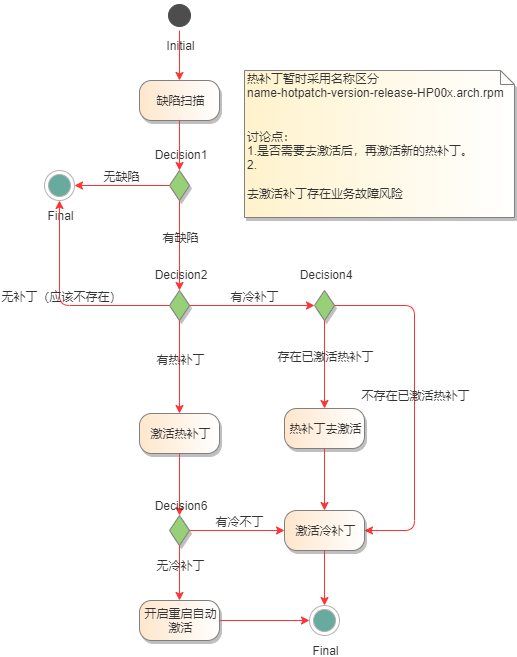
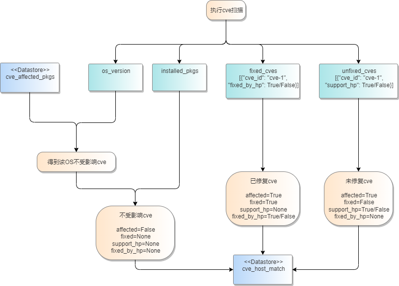
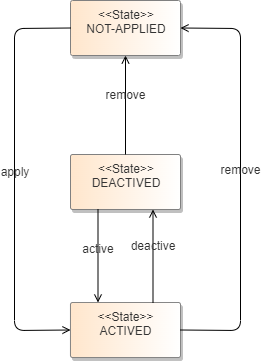
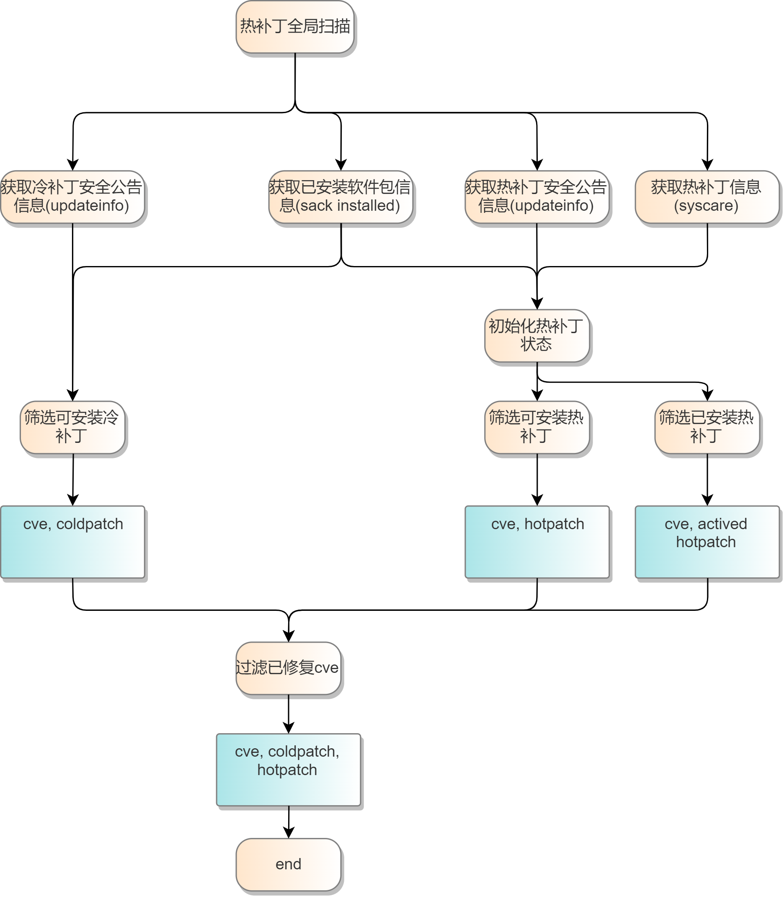
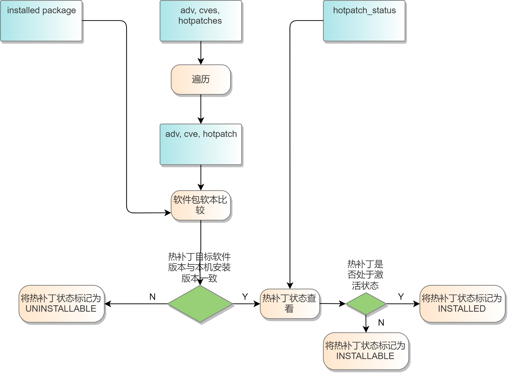
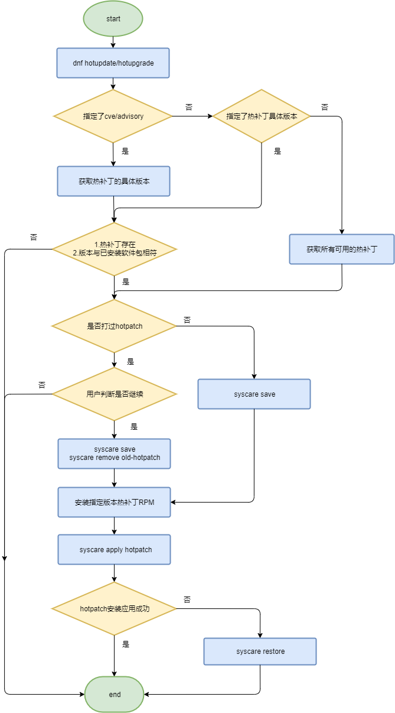
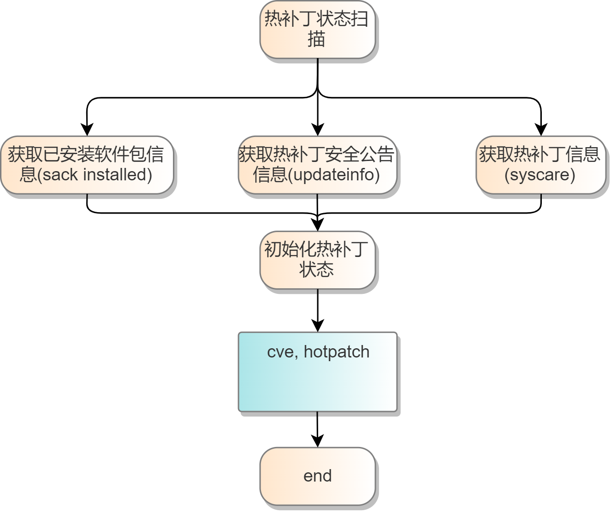
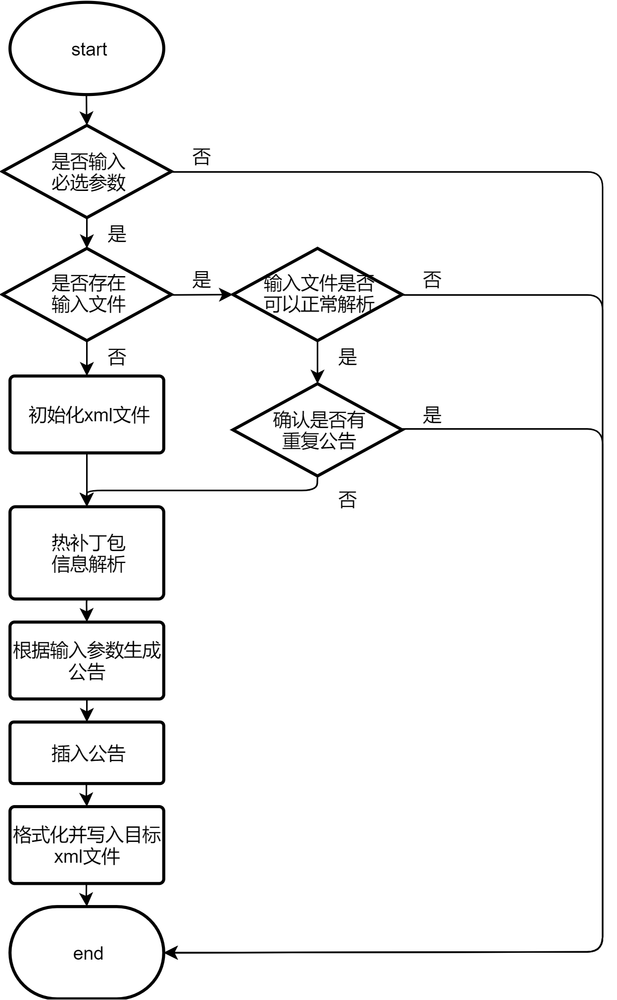

# 1、特性描述

操作系统作作为所有软件的基座，代码量巨大，社区会及时修复每一个发现的安全漏洞和缺陷，如果不及时修复这些问题，可能会带来系统安全隐患和宕机的风险。当前社区存在如下问题：  
1. 目前仅有修复发布，无工具支持检查运行系统CVE和缺陷状态，依赖人为检查，存在实时性和遗漏风险  
2. 无热修复发布，仅支持热修复（内核/用户态热补丁）工具，但是需要用户自己制作，使用复杂  
3. 无集群巡检和管理能力，管理员维护繁复  
3. 热补丁限制多，短期内无法完全替代冷补丁，需要合并两个冷热补丁流程，简化管理流程

aops-apollo为了应对如上问题，提供了缺陷（CVE/bugfix）巡检&修复功能，该功能能够定时扫描集群中主机的缺陷信息，并及时呈现给用户，用户可以在web界面上进行这些缺陷的处理。

**约束限制：**

1. 分层交付，单机-集群
2. 模块化交付，支持单组件使用
3. 插件化扩展，通过插件的机制支持缺陷

## 1.1、受益人

| 角色     | 角色描述                                               |
| :------- | :----------------------------------------------------- |
| 运维人员 | 负责机器运维管理的人员                                 |
| 普通用户 | 个体用户，注册服务后，依赖于该系统对自己的机器进行监控 |

## 1.2、依赖组件

| 组件          | 组件描述                        | 可获得性                        |
| :------------ | :------------------------------ | :------------------------------ |
| elasticsearch | 分布式数据库                    | 官网rpm包安装                   |
| mysql         | 关系型数据库                    | 使用openEuler repo源yum install |
| aops-vulcanus    | A-Ops工具包                     | 使用openEuler repo源yum install |
| aops-zeus  | A-Ops资产管理模块，添加主机需要 | 使用openEuler repo源yum install |
| aops-ceres | 部署在客户端的服务，执行相应命令 | 使用openEuler repo源yum install |
| syscare | 热补丁工具集 | 使用openEuler repo源yum install |
| rpm | rpm管理工具 | 使用openEuler repo源yum install |
| dnf | 软件包管理工具 | 使用openEuler repo源yum install |

## 1.3、License

Mulan V2

# 2、需求场景分析

## 2.1、apollo需求场景分析


apollo需要至少考虑三个主要用户

- 开发者：根据补丁文件完成补丁制作，从个人制作和版本角度，提供便捷的制作工具和流水线；
  - 个人功能诉求：冷热补丁制作；多次制作下简化制作命令（工作环境管理）；
  - 版本功能诉求：通过PR制作补丁；提供基础功能验证；提供开发人员离线调试；支持补丁发布到repo
- 系统管理员：通过补丁服务感知补丁发布信息，通过关注巡检告警，跟踪补丁对运行系统的影响，操作apollo实现补丁修复
  - 功能诉求：补丁订阅；缺陷巡检；巡检告警（邮件）；补丁修复；补丁回退；重启自动修复（热补丁重启自动激活/冷补丁追加修复）；补丁状态查询；第三方漏洞检查工具支持热补丁
- 使用者：重点指个人使用者，提供cli和webui的方式，对自己使用的机器进行缺陷检查和修复
  - 功能诉求：远程热补丁repo；补丁检查；补丁修复；补丁回退；重启自动修复；补丁状态查询

**需求如下**

  - [IR-apollo-hotmake]支持冷热补丁制作和发布
  - [IR-apollo-hotmake-CICD]CICD流水线支持热补丁
  - [IR-apollo-hotmakeinfo]apollo-支持制作热补丁元数据
  - [IR-apollo-hotservice]apollo-service补丁服务
  - [IR-apollo-issue_scanf]apollo-系统缺陷巡检和告警通知
  - [IR-apollo-hot_fix]apollo-系统缺陷支持热补丁修复
  - [IR-apollo-hot_cold_fix]apollo-系统缺陷支持冷热补丁混合管理
  - [IR-apollo-rpm-hot_fix]apollo-支持使用rpm管理热补丁（暂不支持）
  - [IR-apollo-dnf-hot_fix]apollo-支持使用dnf管理热补丁

通过以上业务流程分析，逻辑上分为：

- repo管理：支持热补丁repo配置，单机复用dnf repo配置，集群支持远程和批量配置
- issue信息管理：提供告警接口，提供告警信息获取和第三方告警扩展（邮件）
- 集群管理：提供主机纳管和命令下发通道
- RPM管理：扩展热补丁类型支持（暂是无法支持，通过dnf扩展）
- 热补丁管理：扩展dnf命令支持热补丁操作（单机），提供热补丁制作工具
- 系统缺陷管理：基于热补丁管理，提供巡检和告警管理（集群），通过插件方式支持CVE/Bugfix/Feature。
- aops-hermes：提供webui能力
- 其他：CICD流水线配合，实现PR到补丁发布；补丁服务，提供补丁发布信息订阅能力，根据邮件列表在补丁发布后通知订阅人员


### 2.1.1、支持CVE和Bugfix热补丁制作及信息发布

**包含IR清单**

| IR描述                                             |
| :------------------------------------------------- |
| [IR-apollo-hotmake]支持冷热补丁制作和发布          |
| [IR-apollo-hotmake-CICD]CICD流水线支持热补丁       |
| [IR-apollo-hotservice]apollo-service补丁服务       |
| [IR-apollo-hotmakeinfo]apollo-支持制作热补丁元数据 |


- 热修复除了热补丁限制外，还需要解决热补丁制作问题，通过在CICD中集成热补丁流水线，实现依赖PR完成热补丁制作。除了热补丁交付件本身外，还在updateinfo.xml内嵌入热补丁信息，管理热补丁到CVE和bugfix的关系。本章节主要介绍信息管理，详细热补丁流程参考2.1.1
- 客户手动获取补丁信息容易导致遗漏或者延期：上线补丁服务，支持补丁信息订阅和本地检测
- 为了实现热补丁发布，除了热补丁制作，还需要解决repo元数据的问题：apollo发布件新增热补丁制作工具集，主要包含1.热补丁制作管理，管理热补丁制作环境和提供对外接口；2.提供updateinfo.xml生成工具，根据传入的热补丁名称，PR描述（CVE和Bugfix信息）等，生成具备热补丁信息描述的updateinfo.xml（增量）
  

**补丁制作需求如下**

重点考虑增量补丁制作场景（补丁上打补丁），通过补丁制作项目功能实现管理

热补丁元数据通过扩展updateinfo.xml的方式，扩展出热补丁字段，提供工具支持

- [IR-apollo-hotmake]\[SR-hotmake-001\]支持管理热补丁制作项目
- [IR-apollo-hotmake]\[SR-hotmake-002\]支持热补丁制作（首次）
    - 需要传入补丁文件，源码，debuginfo等完整信息

- [IR-apollo-hotmake]\[SR-hotmake-003\]支持通过热补丁项目制作热补丁
    - 查询已有热补丁制作项目，在增量补丁制作情况，仅需要传入补丁文件

- [IR-apollo-hotmakeinfo]\[SR-hotmakeinfo-001\]创建热补丁updateinfo.xml
    - 通过给定软件包，cve等信息根据下面模板，生成包含热补丁信息的updateinfo.xml
    - 支持指定路径存储updateinfo.xml
- [IR-apollo-hotmakeinfo]\[SR-hotmakeinfo-002\]支持指定缺陷类型/ID/描述/严重等级/缺陷id等
    - 必选项：update-type，title，id，description，severity
    - 可选项：issued-date，update-status（默认stable）,issue链接地址，references-title（为空和title保持一致），reference-type（与update-type自动对应）
    - 其他信息根据热补丁包自动填充
    - 全局配置：update-from，release
- [IR-apollo-hotmakeinfo]\[SR-hotmakeinfo-004\]支持updateinfo与正式补丁包的正确性检测
    - 传入updateinfo.xml和热补丁包路径，检测热补丁是否真实存在，比较文件名和xml中描述是否一致

**CICD需求**


以PR为起点，支持通过PR下面回复命令的方式实现热补丁制作，并管理这些热补丁交付，在最终发布从这些热补丁中发布

1. 通过makerhotpatch <软件版本>，创建对应的issue跟踪热补丁发布流程

2. 同时根据<软件版本>从release目录中获取对应的源码包和debuginfo，在HotPatch仓库中创建对应的[元数据](# 热补丁元数据格式如下：)

3. 对应仓库地址通过issue反馈给开发人员，同时给出热补丁开发指导

4. 开发人员提交热补丁到仓库

   **//后续提需求给ebs，从ebs出接口支持热补丁制作**

- [IR-apollo-hotmake-CICD]\[SR-hotmake-CICD-001\]支持PR评论命令makehotpatch
    - PR合入后自动创建特定格式的热补丁issue
    - 获取src和debuginfo链接，提交到Hotpatch_matedata
    - 准备热补丁制作环境，完善issue信息，反馈给补丁制作和帮助文档给开发人员
    - 提供制作环境下载功能和指导文档，供开发人员自验证
    - 提交补丁到matedata
- [IR-apollo-hotmake-CICD]\[SR-hotmake-CICD-002\]创建热补丁元数据[updateinfo.xml](# **updateinfo.xml参考格式如下**)
    - 热补丁制作成功后，自动创建updateinfo.xml。并与热补丁存储在统一路径

- [IR-apollo-hotmake-CICD]\[SR-hotmake-CICD-003\]热补丁评审发布
    - 收集未发布热补丁issue
    - 根据所选择的issue收集热补丁交付件
    - 根据热补丁清单，更新updateinfo并推送热补丁到repo

**热补丁服务**

- [IR-apollo-hotservice]\[SR-hotservice-001\]支持补丁信息订阅
  - 有新的补丁发布时，支持以邮件和短信的方式发送补丁信息。补丁信息包括CVE/BUG描述，CVE id，涉及软件包列表，是否支持热补丁修复等
- [IR-apollo-hotservice]\[SR-hotservice-002\]安全公告支持热补丁信息显示
  - [cvrf.xml](# cvrf.xml参考格式如下)参考ProductTree新增HotPatchTree字段，存储热补丁信息，方便前台显示
  - 如果存在热补丁，对应安全公告新增热补丁页签

- [IR-apollo-hotservice]\[SR-hotservice-003\]新增热补丁中心展示页面

###### **updateinfo.xml参考格式如下**

```xml
<?xml version="1.0" encoding="UTF-8"?>  
<updates>  
     <update from="openeuler.org" type="security/bugfix/feature" status="stable">  
          <id>openEuler-SA-2021-1502</id>  
          <title>An update for polkit is now available for openEuler-20.03-LTS-SP3</title>  
          <severity>Important</severity>  
          <release>openEuler</release>  
          <issued date="2022-01-27"></issued>  
          <references>  
               <reference href="https://nvd.nist.gov/vuln/detail/CVE-2021-4034" id="CVE-2021-4034" title="CVE-2021-4034" type="cve"></reference>  
          </references>
          <description>xxxxxxxxxxxxx</description>
          <pkglist>
               <collection>
                    <name>openEuler</name>
                    <package arch="aarch64/noarch/x86_64" name="polkit" release="9.oe1" version="0.116">
                         <filename>polkit-0.116-9.oe1.aarch64.rpm</filename>
                    </package>
               </collection>
			   //本次新增字段
			   <hot_patch_collection>
                    <name>openEuler</name>
                    <package arch="aarch64" name="polkit" release="9.oe1" version="0.116">
                         <filename>polkit-0.116-9.oe1.aarch64.rpm</filename>
                    </package>
                    <package arch="noarch" name="polkit-help" release="9.oe1" version="0.116">
                         <filename>polkit-help-0.116-9.oe1.noarch.rpm</filename>
                    </package>
			   </hot_patch_collection>
          </pkglist>
     </update>
</updates>
```

###### **cvrf.xml参考格式如下**


###### **安全公告修改示意图如下**


###### **热补丁元数据格式如下：**

```
<?xml version="1.0" encoding="UTF-8"?>
<hotpatchdoc xmlns="https://gitee.com/openeuler/hotpatch_data" xmlns:cvrf="https://gitee.com/openeuler/hotpatch_data">
	<DocumentTitle xml:lang="en">Managing Hot Patch Metadata</DocumentTitle>
	<HotPatchList>
	<Package Name="kernel-xxxxxxx" Type="cve/bug" statue="i/f/s">
	    <hotpatch version="1">
	        <SRC_RPM>download_link</SRC_RPM>
		    <Debug_RPM>download_link</Debug_RPM>
		</hotpatch>
        <hotpatch version="2">
	        <SRC_RPM>download_link</SRC_RPM>
		    <Debug_RPM>download_link</Debug_RPM>
		</hotpatch>
	</Package>
	</HotPatchList>

</hotpatchdoc>
```

### 2.1.2、系统缺陷支持热补丁修复

**包含IR清单**

| IR描述                                                       |
| :----------------------------------------------------------- |
| [IR-apollo-issue_scanf]apollo-系统缺陷巡检和告警通知         |
| [IR-apollo-rpm-hot_fix]apollo-支持使用rpm管理热补丁（待实现） |
| [IR-apollo-dnf-hot_fix]apollo-支持使用dnf管理热补丁          |
| [IR-apollo-hot_fix]apollo-系统缺陷支持热补丁修复             |
| [IR-apollo-hot_cold_fix]apollo-系统缺陷支持冷热补丁混合管理（待实现） |


- 热补丁最终制作成rpm，通过updateinfo提供与CVE和Bugfix的信息管理。集中通过repo的方式对外发布。
- 提供dnf-plugin-hotpatch使能dnf支持热补丁管理，提供热补丁下载，安装和升级操作。提供根据updateinfo升级热补丁操作，支持info，list，update，updateinfo list/info/summary，新增update --hotpatch接口。
  - update、list、info等
  - 🔥热补丁的rpm如果被update怎么处理？需要补充围绕rpm的冷热补丁流程图和状态图**（原子性/内核升级场景一般是新增）**
  - **//补丁校验（跨系统使用）**
- 对外提供CVE/Bugfix巡检、修复、回退和查询操作，通过集群管理模块提供集群巡检能力
- 需要支持在rpm信息中设置和查询热补丁标签？


**单机需求如下（630重点支持内核热补丁）**

多数为个人用户，场景参考dnf的流程，需要多考虑复位激活的情况，并完整的支持回退

- [IR-apollo-dnf-hot_fix]\[SR-dnf-hot_fix-001\]支持热补丁本地状态查询
  - 支持本地热补丁状态查询，展示所有热补丁的状态，按照不同软件分块
  - 支持按照cve显示所有热补丁的状态
- [IR-apollo-dnf-hot_fix]\[SR-dnf-hot_fix-002\]支持单机检查
  - 开源用户一般是单机使用，本地的agent需要支持配置补丁repo，支持按需检查
- [IR-apollo-dnf-hot_fix]\[SR-dnf-hot_fix-003\]支持热补丁修复
  - 本地热补丁支持按照cve id修复
  - 本地热补丁支持热补丁名称修复
  - 本地热补丁支持全量修复
- [IR-apollo-dnf-hot_fix]\[SR-dnf-hot_fix-004\]热补丁支持回退
  - 本地热补丁支持按照cve id回退
  - 本地热补丁支持按照补丁名称回退

- [IR-apollo-dnf-hot_fix]\[SR-dnf-hot_fix-005\]热补丁支持重启自动激活

  - 支持重启自动激活
  - 支持按照不同热补丁开关自动激活

  说明：

  热补丁重启会丢失，引入Accept状态。具体可参考[热补丁状态图](#3.5.1、热补丁状态图)

  - 激活热补丁后业务测试可能失败，此时处于Actived状态，通过重启可以自动恢复到激活前。	

  - accept后热补丁重启后会自动生效

**流程图示意**



**集群需求**

*集群一致性是需要考虑的重点？*

- [IR-apollo-hot_fix]\[SR-apollo-hot_fix-001\]支持集群巡检
  - 支持手动巡检
  - 通过配置巡检周期，实现后台自动自动巡检
  - 巡检后生成待修复清单，并调用告警接口通知客户

- [IR-apollo-hot_fix]\[SR-apollo-hot_fix-002\]支持集群修复
- [IR-apollo-hot_fix]\[SR-apollo-hot_fix-003\]支持集群回退
- [IR-apollo-hot_fix]\[SR-apollo-hot_fix-004\]支持集群热补丁查询
- [IR-apollo-hot_fix]\[SR-apollo-hot_fix-005\]热补丁支持告警和通知
  - 支持邮件方式通知，邮件模板支持配置，明确配置元素（630若来不及，先提供默认模板，不支持修改），必须包含缺陷信息，补丁信息，是否支持热补丁，系统主页链接
  - 集群巡检结束后，如果有新增热补丁，通过邮件通知（告警清单）

**冷热补丁混合管理（待分析）**

单冷补丁流程在原有dnf流程下，进一步考虑如何实现原子回退（与升级讨论）

新增热补丁情况，重点分析冷热补丁依赖，还有冷热补丁混合存在是否出现一致性问题


**可靠性分析**

在增量热补丁场景下现有方案需要先去激活已有补丁，再次激活前，存在缺陷暴露时间，会再次会系统造成影响

***集群场景下存在远程命令执行超时和失败的情况，导致集群状态一致性被破坏（重要）***

- [IR-apollo-dnf-hot_fix]\[SR-dnf-hot_fix-RAS-001\]支持增量热补丁
  - 通过增量的方式，直接覆盖现有补丁，避免去激活，来避免缺陷暴露

- **[IR-apollo-hot_fix]\[SR-apollo-hot_fix-RAS-001\]集群状态一致性（重要）**

  

**参考信息**

- suse对metadata的定义https://en.opensuse.org/openSUSE:Standards_Rpm_Metadata

### 2.1.3、repo设置Use Case

- 要完成cve管理首先需要update repo源的管理，基于openEuler的安全策略：cve在修复后会以安全公告以及update版本的形式对外发布，所以这里需要用户配置openEuler对应版本的update repo源，随后才能通过yum命令获取到当前节点存在的cve信息，以及做进一步的cve修复操作。

- 可以识别出用户需要的功能为：

  - repo源管理，用户能够查看、添加、更新、删除其名下的repo源。

  - 配置repo源，用户可以选择给指定的主机配置指定的repo源，这里涉及到任务的管理。

  - 下载repo源模板，为方便用户添加repo，专门提供了repo模板。


### 2.1.4、cve扫描Use Case

- 当配置好相应的repo源后，执行一种指定的cve扫描方式（如根据openEuler的安全公告来识别当前管理主机已安装软件包的cve信息），即可获取到某指定主机的cve信息。
- 可以识别出用户需要的功能为：
  - 安全公告导入，首先需要一份全量cve信息数据库，后续才能关联这些信息。
  - cve扫描，这里涉及到扫描任务的管理（创建、执行、进度查询、结果查看）。
  - 扫描报告导出，方便用户查看更详细的信息。


### 2.1.5、cve信息查询Use Case

- 扫描出来的信息需要清晰直观地呈现给用户，因此要提供给用户一个查询的界面。并且在上面能够做一些筛选和评审。
- 可以识别出用户需要的功能为：
  - cve信息查询，包括cve信息总览、cve列表、cve详情等
  - 主机维度查询，获取主机列表，获取主机的cve信息等。


### 2.1.6、cve修复Use Case

- 当用户完成cve扫描、评审后，需要对识别出来cve的主机进行修复，后端通过aops的管理组件下发命令到agent端的方式来执行修复任务，同时需要支持cve修复回滚。

- 可以识别出用户需要的功能为：

  - cve修复任务管理，如执行cve扫描，查看cve修复任务的详情，查询具体某个cve的进度，状态查询，结果查询，执行cve修复回滚等。

  - cve修复回滚，当修复后存在问题时，需要及时回滚。


## 2.2、Story分解

### 2.2.1、22.03-LTS需求分解

| Use Case    | Story                         | 模块         | 说明 |
| ----------- | ----------------------------- | ------------ | ----------- |
| repo设置    | 查看repo源                    | repo信息管理 |  |
|             | 添加repo源                    | repo信息管理 |  |
|             | 更新repo源                    | repo信息管理 |  |
|             | 删除repo源                    | repo信息管理 |  |
|             | 创建配置repo源任务          | 任务管理     |  |
|             | 查询配置repo源任务          | 任务管理     |  |
|             | 执行配置repo源任务          | 任务管理     |  |
|             | 查询配置repo源任务进度      | 任务管理     |  |
|             | 查询配置repo源任务结果      | 任务管理     |  |
|             | 删除配置repo源任务      | 任务管理     |  |
|             | 下载repo源模板                | repo信息管理 |  |
| cve扫描     | 导入/解析安全公告        | cve信息管理  |  |
|             | 执行cve扫描任务             | 任务管理     |  |
|             | 查询主机的扫描状态 | 任务管理 |  |
| cve信息查询 | cve统计信息总览               | cve信息管理  |  |
|             | 查看cve列表                   | cve信息管理  |  |
|             | 查看cve具体信息               | cve信息管理  |  |
|             | 获取某cve主机相关详细信息     | cve信息管理 |  |
|             | 获取多个cve对应的主机基本信息 | cve信息管理 |  |
|             | 查询修复cve后的一系列操作     | cve信息管理 |  |
|  | 获取主机列表 | cve信息管理 |  |
|             | 获取主机详细信息（基础信息+cve数量统计） | cve信息管理 |  |
|             | 获取指定主机的详细cve信息 | cve信息管理 |  |
| cve修复     | 创建cve修复任务             | 任务管理     |  |
|             | 查询cve修复任务详情         | 任务管理     |  |
|             | 执行cve修复任务               | 任务管理     |  |
|             | 查询cve修复任务进度         | 任务管理     |  |
|             | 查询cve修复任务主机的状态 | 任务管理     |  |
|             | 查询cve修复任务结果 | 任务管理 |  |
|             | 删除cve修复任务 | 任务管理 |  |

### 2.2.2、22.03-LTS-SP1版本需求分解

| Use Case    | Story                     | 模块        | 说明                                 |
| ----------- | ------------------------- | ----------- | ------------------------------------ |
| repo设置    | 创建配置repo源任务        | 任务管理    | 不再需要pb                           |
|             | 执行配置repo源任务        | 任务管理    | 由ansible的执行方式修改为agent端执行 |
| cve扫描     | 导入/解析安全公告         | cve信息管理 | 支持解析不受影响cve                  |
|             | 执行cve扫描任务           | 任务管理    | 由ansible的执行方式修改为agent端执行 |
|             | 生成/导出cve报告          | cve信息管理 |                                      |
| cve信息查询 | 获取指定主机的详细cve信息 | cve信息管理 | 支持筛选不受影响cve                  |
| cve修复     | 创建cve修复任务           | 任务管理    | 不再需要pb                           |
|             | 执行cve修复任务           | 任务管理    | 由ansible的执行方式修改为agent端执行 |

### 2.2.3、22.03-LTS-SP1 update版本需求分解

| Use Case               | Story                          | 模块        | 说明            |
| ---------------------- | ------------------------------ | ----------- | --------------- |
| cve扫描                | 定时扫描配置主机               | 任务管理    |                 |
|                        | 定时矫正扫描状态               | 任务管理    |                 |
| repo设置               | 定时矫正repo设置状态           | 任务管理    |                 |
| cve信息查询            | 导出cve报告中呈现已修复cve信息 | cve信息管理 |                 |
| cve修复                | 定时矫正cve修复状态            | 任务管理    |                 |
|                        | 支持选择热补丁修复方式         | 任务管理    |                 |
| 系统缺陷支持热补丁修复 | 支持识别热补丁信息             | 热补丁插件  | 作为dnf插件集成 |
|                        | 支持热补丁生命周期管理         | 热补丁插件  | 作为dnf插件集成 |
|                        | 支持热补丁生成                 | 热补丁工具  |                 |

### 2.2.4、22.03-LTS-SP2 版本需求分解

| Use Case               | Story                                      | 模块                                               | 说明                 |
| ---------------------- | ------------------------------------------ | -------------------------------------------------- | -------------------- |
| 支持制作热补丁元数据   | 创建热补丁updateinfo.xml                   | [updateinfo.xml制作工具](#3.6、updateinfo制作工具) |                      |
|                        | 支持指定缺陷类型/ID/描述/严重等级/缺陷id等 | [updateinfo.xml制作工具](#3.6、updateinfo制作工具) |                      |
|                        | 支持updateinfo与正式补丁包的正确性检测     | [updateinfo.xml制作工具](#3.6、updateinfo制作工具) |                      |
| 官网提供补丁订阅服务   | 支持补丁信息订阅                           | openEuler官网提供                                  |                      |
| CICD流水线支持热补丁   | 支持PR评论命令makehotpatch                 | 社区CICD流程支持                                   |                      |
|                        | 安全公告包含热补丁信息                     | 社区CICD流程支持                                   |                      |
|                        | 创建热补丁元数据updateinfo.xml             | 社区CICD流程支持                                   |                      |
|                        | 热补丁评审发布                             | 社区CICD流程支持                                   |                      |
| 系统缺陷巡检和告警通知 | 支持集群巡检                               | 任务管理                                           | 部分接口需要重新适配 |
|                        | 热补丁支持告警和通知                       | 告警                                               |                      |
| 系统缺陷支持热补丁修复 | 支持集群修复                               | 任务管理                                           | 部分接口需要重新适配 |
|                        | 支持集群热补丁回退                         | 任务管理                                           |                      |
|                        | 支持集群热补丁查询                         | cve信息管理                                        |                      |
| 支持使用dnf管理热补丁  | 支持热补丁本地状态查询                     | [热补丁插件](#5.2.3、热补丁状态管理)               | 作为dnf插件集成      |
|                        | 支持热补丁修复                             | [热补丁插件](#5.2.2、热补丁修复)                   | 作为dnf插件集成      |
|                        | 热补丁支持回退                             | [热补丁插件](#5.2.3、热补丁状态管理)               | 作为dnf插件集成      |
|                        | 热补丁支持重启自动激活                     | [热补丁插件](#5.2.3、热补丁状态管理)               | 作为dnf插件集成      |

# 3、模块设计


- API

  cve管理服务对外提供restful api接口，可结合配套的aops-hermes使用，其提供了web操作界面。

- 服务层

  主要功能分为三个模块，分别是cve信息管理模块、repo信息管理模块、任务管理模块，其中：

  - cve信息管理模块负责cve信息的不同维度的统计，cve状态的修改，安全公告解析；

  - repo管理模块负责update repo源的增删改查管理，提供了repo源的模板下载；

  - 任务管理模块负责cve扫描、修复、回滚、repo配置等任务的生成，任务中间状态的存储与查询，任务执行，以及定时任务（cve扫描、cve安全公告解析）的执行。

- 依赖服务/库

  该服务依赖于其他服务/库提供的功能，主要是aops-zeus，aops-ceres，aops-vulcanus，其中：

  - aops-zeus服务为aops的管理服务，提供基本的主机管理功能，为该服务提供主机ip等基本信息，并提供命令下发通道；
  - aops-ceres服务部署在客户端侧，提供cve修复需要的系列命令执行功能，如执行cve的修复命令（yum update --cve=xxx）；
  - aops-vulcanus为aops的工具库，提供了配置解析、日志管理、response封装等常用工具库。
  
- 数据库

  该软件依赖于两个数据库，分别为elasticsearch和mysql，其中：

  - elasticsearch存储复杂的cve软件包信息以及修复日志信息；
  - mysql存储cve与主机的关系信息、任务的基础信息。
  
- 热补丁dnf插件

  基于dnf插件框架开发热补丁扫描、安装及状态切换的dnf插件，为漏洞修复提供热补丁修复的能力。同时，为补充社区热补丁发布能力，开发updateinfo.xml生成工具，用于生成记录热补丁元数据的hotpatch.xml，后续发布update版本时将其补充进updateinfo.xml。

## 3.1、repo信息管理

### 3.1.1、repo源模板下载

提供repo源模板下载，方便用户直接在模板上编写后提交

```shell
[update]
name=update
baseurl=http://repo.openeuler.org/openEuler-22.03/update/$basearch
enabled=1
```

## 3.2、cve信息管理

### 3.2.1、cve信息导出

支持用户导出cve信息列表，按照主机维度，每个主机信息一个csv文件，

文件命名格式如：【hostname】

文件内容如下：

| cve名称 | 状态     | 修复状态 | 修复方式 |
| ------- | -------- | -------- | -------- |
| cve-1-1 | 不受影响 | 已修复   | -        |
| cve-1-2 | 受影响   | 未修复   | -        |
| cve-1-3 | 受影响   | 已修复   | 热补丁   |
| cve-1-4 | 受影响   | 已修复   | 冷补丁   |

## 3.3、安全公告管理

cve修复信息来自于安全公告与不受影响cve信息，需要在界面上导入，做一定解析后存入数据库中。

### 3.3.1、安全公告解析

- 安全公告提供了已修复的cve信息，当前支持文件格式：
  - zip，为xml的合集
  - xml
- 安全公告格式如下：

```xml
<?xml version="1.0" encoding="UTF-8"?>
<cvrfdoc xmlns="http://www.icasi.org/CVRF/schema/cvrf/1.1" xmlns:cvrf="http://www.icasi.org/CVRF/schema/cvrf/1.1">
	<DocumentTitle xml:lang="en">An update for python-lxml is now available for openEuler-20.03-LTS-SP1 and openEuler-20.03-LTS-SP2 and openEuler-20.03-LTS-SP3</DocumentTitle>
	<DocumentType>Security Advisory</DocumentType>
	<DocumentNotes>
		<Note Title="Synopsis" Type="General" Ordinal="1" xml:lang="en">python-lxml security update</Note>
		<Note Title="Summary" Type="General" Ordinal="2" xml:lang="en">An update for python-lxml is now available for openEuler-20.03-LTS-SP1 and openEuler-20.03-LTS-SP2 and openEuler-20.03-LTS-SP3.</Note>
		<Note Title="Description" Type="General" Ordinal="3" xml:lang="en">XML processing library combining libxml2/libxslt with the ElementTree API.

Security Fix(es):

lxml is a library for processing XML and HTML in the Python language. Prior to version 4.6.5, the HTML Cleaner in lxml.html lets certain crafted script content pass through, as well as script content in SVG files embedded using data URIs. Users that employ the HTML cleaner in a security relevant context should upgrade to lxml 4.6.5 to receive a patch. There are no known workarounds available.(CVE-2021-43818)</Note>
		<Note Title="Topic" Type="General" Ordinal="4" xml:lang="en">An update for python-lxml is now available for openEuler-20.03-LTS-SP1 and openEuler-20.03-LTS-SP2 and openEuler-20.03-LTS-SP3.

openEuler Security has rated this update as having a security impact of high. A Common Vunlnerability Scoring System(CVSS)base score,which gives a detailed severity rating, is available for each vulnerability from the CVElink(s) in the References section.</Note>
		<Note Title="Severity" Type="General" Ordinal="5" xml:lang="en">High</Note>
		<Note Title="Affected Component" Type="General" Ordinal="6" xml:lang="en">python-lxml</Note>
	</DocumentNotes>
	<ProductTree xmlns="http://www.icasi.org/CVRF/schema/prod/1.1">
		<Branch Type="Product Name" Name="openEuler">
			<FullProductName ProductID="openEuler-20.03-LTS-SP1" CPE="cpe:/a:openEuler:openEuler:20.03-LTS-SP1">openEuler-20.03-LTS-SP1</FullProductName>
			<FullProductName ProductID="openEuler-20.03-LTS-SP2" CPE="cpe:/a:openEuler:openEuler:20.03-LTS-SP2">openEuler-20.03-LTS-SP2</FullProductName>
		</Branch>
	</ProductTree>
	<Vulnerability Ordinal="1" xmlns="http://www.icasi.org/CVRF/schema/vuln/1.1">
		<Notes>
			<Note Title="Vulnerability Description" Type="General" Ordinal="1" xml:lang="en">lxml is a library for processing XML and HTML in the Python language. Prior to version 4.6.5, the HTML Cleaner in lxml.html lets certain crafted script content pass through, as well as script content in SVG files embedded using data URIs. Users that employ the HTML cleaner in a security relevant context should upgrade to lxml 4.6.5 to receive a patch. There are no known workarounds available.</Note>
		</Notes>
		<ReleaseDate>2022-01-07</ReleaseDate>
		<CVE>CVE-2021-43818</CVE>
		<ProductStatuses>
			<Status Type="Fixed">
				<ProductID>openEuler-20.03-LTS-SP1</ProductID>
				<ProductID>openEuler-20.03-LTS-SP2</ProductID>
				<ProductID>openEuler-20.03-LTS-SP3</ProductID>
			</Status>
		</ProductStatuses>
		<Threats>
			<Threat Type="Impact">
				<Description>High</Description>
			</Threat>
		</Threats>
		<CVSSScoreSets>
			<ScoreSet>
				<BaseScore>7.1</BaseScore>
				<Vector>AV:N/AC:L/PR:N/UI:R/S:C/C:L/I:L/A:L</Vector>
			</ScoreSet>
		</CVSSScoreSets>
		<Remediations>
			<Remediation Type="Vendor Fix">
				<Description>python-lxml security update</Description>
				<DATE>2022-01-07</DATE>
				<URL>https://www.openeuler.org/en/security/safety-bulletin/detail.html?id=openEuler-SA-2022-1482</URL>
			</Remediation>
		</Remediations>
	</Vulnerability>
</cvrfdoc>
```

### 3.3.2、不受影响cve信息解析

- 不受影响cve信息的文件格式（xml）如下：

```xml
<?xml version="1.0" encoding="UTF-8"?>
<cvrfdoc xmlns="http://www.icasi.org/CVRF/schema/cvrf/1.1" xmlns:cvrf="http://www.icasi.org/CVRF/schema/cvrf/1.1">
	<Vulnerability Ordinal="1" xmlns="http://www.icasi.org/CVRF/schema/vuln/1.1">
		<Notes>
			<Note Title="Vulnerability Description" Type="General" Ordinal="1" xml:lang="en">A flaw was found in OpenEXR s hufDecode functionality. This flaw allows an attacker who can pass a crafted file to be processed by OpenEXR, to trigger an undefined right shift error. The highest threat from this vulnerability is to system availability.</Note>
		</Notes>
		<CVE>CVE-2021-20304</CVE>
		<ProductStatuses>
			<Status Type="Unaffected">
				<ProductID>openEuler-22.03-LTS</ProductID>
			</Status>
		</ProductStatuses>
		<CVSSScoreSets>
			<ScoreSet>
				<BaseScore>5.3</BaseScore>
				<Vector>AV:N/AC:L/PR:N/UI:N/S:U/C:N/I:N/A:L</Vector>
			</ScoreSet>
		</CVSSScoreSets>
		<Remediations>
			<Remediation Type="Unaffected">
				<Description>OpenEXR</Description>
				<DATE>2022-08-29</DATE>
				<ProductID>openEuler-22.03-LTS</ProductID>
			</Remediation>
		</Remediations>
	</Vulnerability>
</cvrfdoc>
```

### 3.3.3、已下载安全公告查看

用户可以在前端界面查看到系统已导入的安全公告列表和导入时间等信息。待后续实现。

### 3.3.4、数据库

- **`cve`**

| cve_id         | severity | cvss_score | publish_time | reboot |
| -------------- | -------- | ---------- | ------------ | ------ |
| CVE-2021-43818 | High     | 7.1        | 2022-01-07   | False  |
| CVE-2021-20304 |          | 5.3        | 2022-08-29   | False  |
|                |          |            |              |        |

- **`cve_affected_pkgs`**

| cve_id         | package     | package_version | os_version              | affected |
| -------------- | ----------- | --------------- | ----------------------- | -------- |
| CVE-2021-43818 | python-lxml | 4.6.5-2         | openEuler-20.03-LTS-SP1 | True     |
| CVE-2021-43818 | python-lxml | 4.6.5-2         | openEuler-20.03-LTS-SP2 | True     |
| CVE-2021-43818 | python-lxml | 4.6.5-2         | openEuler-20.03-LTS-SP3 | True     |
| CVE-2021-20304 | OpenEXR     |                 | openEuler-22.03-LTS     | False    |

## 3.4、任务管理

### 3.4.1、常规任务

任务管理模块提供功能：repo源设置、cve扫描、cve修复等任务的创建、任务进度查询/回调功能

- 任务管理定义了一套规范，由manager控制：
  - 任务创建（create_task）
  - 前置操作（pre_handle），主要是数据库里一些相应状态的修改，
  - 任务执行（handle），这里的任务执行主要通过向aops-zeus发送restful请求进行，aops-zeus校验后会再向客户端发送命令执行请求。
  - 回调（callback），为实时反馈任务进度，restful请求中带了回调函数地址，每当一个子任务完成，会通过回调函数实时更新任务状态。
  - 任务后置处理（post_handle），主要将任务结果经过处理后刷新到数据库中。
  - 错误处理（fault_handle），为防止网络原因等问题导致任务进度刷新失败、任务执行失败等，需要再将数据库中的状态刷新。
- 流程图


- 时序图


- UML图

  待补充

- 任务状态总计5种，分别为：
  - succeed（表示repo设置成功、cve修复成功）
  - fail（表示repo设置失败、cve修复失败）
  - running（表示任务运行中）
  - done（表示cve扫描完成）
  - unknown（由于网络等原因导致回调失败不能正确更新数据库任务状态时设置为该状态）

#### 3.4.1.1、任务列表

##### 3.4.1.1.1、repo源设置

- create_task
  
  - 将任务信息存入数据库，该任务主要是将repo源下发到客户端指定路径
  
  - 生成任务信息（与aops-ceres服务约定任务模板）
  
    ```json
    {
        "task_id": "1",
        "task_name": "",
        "task_type": "repo set",
        "total_hosts": ["id1", "id2"],
        // 一些预置检查需要，如检查网络等，当检查失败时，停止执行任务
        "check_items": [],
        "repo_info": {
            // repo名称
            "name": "",
            // 存放路径
            "dest": "/etc/yum.repos.d/aops-update.repo",
            // repo内容，以字符串形式呈现
            "repo_content": ""
        },
        "tasks": [
            {
                "host_id": "id1",
                // 是否执行预置检查
                "check": false
            },
            {
                "host_id": "id2",
                "check": false
            }
        ],
        "callback": "/vulnerability/task/callback/repo/set"
    }
    ```
  
- pre_handle
  
  - 更新repo设置任务的状态为`running`
  - 更新任务执行时间为当前时间
  
- handle

  - 向aops-zeus发送restful请求
  - 回调函数地址：/vulnerability/task/callback/repo/set

- callback

  - callback_on_ok：更新repo任务相应主机的status为`succeed`，更新该主机的repo_name为当前设置repo
  - callback_on_failed：更新repo任务相应主机的status为fail

- post_handle

  - 合并所有主机的结果，存储（包含执行日志）到数据库中

    ```json
    {
        "task_id": "1",
        "task_name": "",
        "task_type": "repo set",
        "latest_execute_time": 111,
        "task_result": [
            {
                "host_id": "",
                "host_name": "",
                "host_ip": "",
                // repo名称
                "repo": "",
                // 该任务是否执行成功，可为succeed，fail，unknown
                "status": "succeed",
                "check_items": [
                    {
                        "item": "network",
                        "result": true
                    }
                ],
                "log": ""
            }
        ]
    }
    ```

- fault_handle

  - 设置状态还在运行中的主机为`unknown`

##### 3.4.1.1.2、cve扫描

- create_task

  - 该任务主要是对指定主机进行扫描，在配置update的repo源后，执行dnf hotpatch list或dnf updateinfo list cves installed，即可得到该主机已安装软件的未修复cve列表

  - 生成任务信息（与aops-ceres服务约定任务模板）

    ```json
    {
        "task_id": "",
        "task_name": "",
        "task_type": "cve scan",
        "total_hosts": ["id1", "id2"],
        // 一些预置检查需要，如检查repo源是否已配置
        "check_items": [],
        "tasks": [
            {
                "host_id": "id1",
                // 是否执行预置检查
                "check": false
            },
            {
                "host_id": "id2",
                "check": false
            }
        ],
        "callback": "/vulnerability/task/callback/cve/scan"
    }
    ```

- pre_handle

  - 更新主机的状态为`scanning`

- handle

  - 向aops-zeus发送restful请求
  - 回调函数地址：/vulnerability/task/callback/cve/scan

- callback

  返回的信息为

  ```json
  {
  	”task_id“: "",
  	"status": "",
  	"host_id": "",
  	"os_version": "",
  	"installed_packages": [
  		{
  			"name": "kernel",
  			"version": "4.19.90-2022.1.1"
  		}
  	],
  	"cves": [
  		{
  			"cve_id": "CVE-1-1",
  			"hotpatch": true
  		},
  		{
  			"cve_id": "CVE-1-2",
              "hotpatch": false
  		}
  	]
  }
  ```

  - 解析主机cve信息，存入数据库
    
    
    
    - 根据cve_affected_pkgs{"os_version==os_version"}查询得到cve信息{cve_id, package, package_version, os_version, affected}。与installed_packages进行比较，得到不受影响cve列表。此时fixed、support_hp、fixed_by_hp字段均无意义，置为None
    - 得到的已修复漏洞affected和fixed字段均为True，fixed_by_hp字段根据是否由热补丁修复的真实情况进行取值。由于该漏洞已被修复，support_hp字段此时意义不大，置为None
    - 得到的未修复漏洞affected字段为True，fixed字段为False，support_hp字段根据是否支持热补丁修复的真实情况进行取值。由于该漏洞未被修复，故fixed_by_hp字段无意义，置为None
    - 存入数据库

  - 修改主机状态为`done`

- post_handle

  - 不做任何操作

- fault_handle

  - 设置状态还在扫描中的主机为`done`

##### 3.4.1.1.3、cve修复

- create_task

  - 该任务主要是对指定主机的指定cve进行修复，在配置update的repo源后，对于冷补丁执行dnf update --cve cve_id完成该cve的修复，对于热补丁执行dnf hotpatch --cve cve_id完成修复。

  - 生成任务信息（与aops-ceres服务约定任务模板）

    ```json
    {
        "task_id": "2",
        "task_name": "",
        "task_type": "cve fix",
        "total_hosts": ["id1", "id2"],
        // 一些预置检查需要，如检查repo源是否已配置
        "check_items": ["network"],
        "tasks": [
            {
                "host_id": "id1",
                // 是否执行预置检查
                "check": true,
                "cves": [
                    {
                        "cve_id": "cve1",
                        "hotpatch": true
                    },
                    {
                        "cve_id": "cve2",
                        "hotpatch": false
                    }
                }
            },
            {
                "host_id": "id2",
                "check": true,
                "cves": [
                    {
                        "cve_id": "cve1",
                        "hotpatch": true
                    }
                ]
            }
        ],
        "callback": "/vulnerability/task/callback/cve/fix"
    }
    ```

- pre_handle

  - 更新主机的状态为`running`，修改进度为0
  - 更新任务执行时间为当前时间

- handle

  - 向aops-zeus发送restful请求
  - 回调函数地址：/vulnerability/task/callback/cve/fix

- callback

  - callback_on_ok：更新cve修复任务相应主机相应cve的status为`succeed`，更新这些修复cve的进度
  - callback_on_failed：更新cve修复任务相应主机相应cve的status为`fail`

- post_handle

  - 合并所有主机的结果，存储（包含执行日志）到数据库中

    ```json
    {
        "task_id": "2",
        "task_name": "",
        "task_type": "cve_fix",
        "latest_execute_time": 111,
        "task_result": [
            {
                "host_id": "",
                "host_name": "",
                "host_ip": "",
                // 该任务是否执行成功，可为succeed，fail，unknown
                "status": "fail",
                "check_items": [
                    {
                        "item": "network",
                        "result": true
                    }
                ],
                "cves": [
                    {
                        "cve_id": "cve1",
                        "log": "",
                        "result": "unfixed"
                    },
                    {
                        "cve_id": "cve2",
                        "log": "",
                        "result": "fixed"
                    }
                ]
            }
        ]
    }
    ```

- fault_handle

  - 设置状态还在运行中的主机的状态为`unknown`
  - 补齐修复cve任务的进度

#### 3.4.1.2、任务回调

#### 3.4.1.3、任务回滚

### 3.4.2、定时任务

#### 3.4.2.1、安全公告下载

#### 3.4.2.2、主机扫描

#### 3.4.2.3、数据矫正

## 3.5、热补丁插件

### 3.5.1、热补丁状态图

热补丁的rpm包安装后，可以通过dnf hotpatch list 查看热补丁的状态。

NOT-APPLIED: 热补丁尚未安装

DEACTIVED: 热补丁已被安装

ACTIVED: 热补丁已被激活

ACCEPT: 热补丁已被接受，后续重启后会被自动打上




### 3.5.2、热补丁命名

```
patch-[软件名称]-[软件版本]-[热补丁名称]-[热补丁版本].[架构].rpm

# example
patch-kernel-5.10.0-60.66.0.91.oe2203-HP001-1-1.x86_64.rpm
```

### 3.5.3、热补丁扫描

#### 3.5.3.1、全局扫描流程图



#### 3.5.3.2、热补丁状态初始化




#### 3.5.3.3、伪代码

```shell
input:
    installed_packages
    updateinfo
    syscareinfo

for package, hotpatch in $syscareinfo:
	save {$package, $hotpatch} to $hotpatchinfo

result = []
for package in $installed_packages:
	# filter cves which $cve.coldpatch_version is higher than $package.version
	extract cve_list from $updateinfo and $pacakge
	for cve in $cve_list:
		tmp = -
		for hotpatch in $cve.hotpatches:
			if $hotpatch.package_version == $pacakge.version:
				$tmp = $hotpatch
				break
		# already hot fixed, ignore it
		if $tmp in $hotpatchinfo:
			continue
		append {$cve, $tmp} to $result

output $result
```

#### 3.5.3.4、CASE

**`pre condition`**

```
CVE-1:
    hotpatch:
        A-hotpatch-1.0-HP001
    coldpatch:
        A-1.1
CVE-2: 
    hotpatch:
        A-hotpatch-1.1-HP001
        A-hotpatch-1.0-HP002
    coldpatch:
        A-1.2
CVE-3:
    hotpatch:
        A-hotpatch-1.1-HP002
    coldpatch:
        A-1.3
```

**`CASE 1`**

```
installed package: A-1.0
actived hotpatch:

# dnf hot-updateinfo list cves
# 扫描得到3个cve
CVE-1  xxx  A-hotpatch-1.0-HP001
CVE-2  xxx  A-hotpatch-1.0-HP002
CVE-3  XXX  -
```

**`CASE 2`**

```
installed package: A-1.0
actived hotpatch: A-hotpatch-1.0-HP001

# dnf hot-updateinfo list cves
//hufeng:热补丁巡检，命令字list是否合适，待讨论
# 扫描得到2个cve，CVE-1因为已被热修复故不做展示
CVE-2  xxx  A-hotpatch-1.0-HP002
CVE-3  xxx  -
```

**`CASE 3`**

```
installed package: A-1.0
actived hotpatch: A-hotpatch-1.0-HP002

# dnf hot-updateinfo list cves
# 扫描得到1个cve
CVE-3  xxx  -
```

**`CASE 4`**

```
installed package: A-1.1
actived hotpatch: 

# dnf hot-updateinfo list cves
# 扫描得到2个cve
CVE-2  xxx  A-hotpatch-1.1-HP001
CVE-3  xxx  A-hotpatch-1.1-HP002
```

**`CASE 5`**

```
installed package: A-1.1
actived hotpatch: A-hotpatch-1.1-HP001

# dnf hot-updateinfo list cves
# 扫描得到1个cve
CVE-3  xxx  A-hotpatch-1.1-HP002
```

### 3.5.4、热补丁修复

热补丁主要支持以下三种修复方案：

- 本地热补丁支持按照cve id修复
- 本地热补丁支持热补丁名称修复
- 本地热补丁支持全量修复，参考dnf update/upgrade

流程图如下：



具体命令参考：[热补丁状态管理](#5.2.3、热补丁状态管理)

### 3.5.5、热补丁状态管理

实现思路为dnf插件封装syscare 相关命令，并通过对热补丁updateinfo.xml的解析，将cve信息与热补丁进行关联展示。

- 热补丁状态查询



具体命令参考：[热补丁状态管理](#5.2.3、热补丁状态管理)

## 3.6、updateinfo制作工具

- 创建热补丁updateinfo.xml
- 支持指定缺陷类型/ID/描述/严重等级/缺陷id等
- 支持updateinfo与正式补丁包的正确性检测（待实现）

实现思路：





## 3.7、热补丁工具

由[syscare项目](https://gitee.com/src-openeuler/syscare)实现。


## 3.8、CICD热补丁流水线

CICD热补丁流水线流程：


### 3.8.1、热补丁制作

#### 3.8.1.1、源码门禁工程

##### 3.8.1.1.1、创建门禁工程

> 在支持热补丁制作的代码仓下单独创建工程，用来在pr下触发工程。

src-openEuler/openEuler下的pr由用户评论makehotpatch后，触发热补丁制作以及热补丁issue生成，将生成的issue链接以及ci运行提示和结果评论在该pr下方。

```shell
/makerhotpatch <软件版本> <补丁名> <补丁type> <cve_issue id> <os_branch>
```

##### 3.8.1.1.2、门禁工程流程

**创建issue**

- 创建特定格式的热补丁issue，热补丁issue提在hotpatch_metadata仓库

  标题：[HOTPATCH]/[软件-版本号]fix  issue_id

  类型选择：hotpatch

  描述：  	

  ```
  问题类别：cve/bugfix （从cve issue中获取）
  热补丁元数据：https://gitee.com/wanghuan158/hot-patch_metadata/blob/master/openEuler-22.03-LTS-SP1/openssl/1.1.1m-20/hotmetadata.xml
  
  热补丁路径：需要在热补丁制作成功后回填
  ```

- 创建完成后在源码仓pr中返回issue链接

**submit metadata**

- 获取包链接：根据<软件版本>从release目录中获取对应的源码包和debuginfo链接，在HotPatch_metadata仓库中创建或更新对应的元数据，debuginfo区分架构

- 生成hotmetadata.xml：

  git clone HotPatch_metadata仓库，根据软件包、版本信息查找是否有hotmetadata.xml

  无hotmetadata.xml：创建hotmetadata.xml

  有hotmetadata.xml：拿到最新的版本号，添加hotpatch，version+1，获取上次生成的src包

- 获取patch包：根据本次pr提交信息拿到patch文件

- 提交pr：提交pr (patch文件、hotmetadata.xml) 到HotPatch_metadata仓库

- 结果返回：源码仓pr中返回HotPatch_metadata仓库pr链接

元数据格式：

```xml
<?xml version="1.0" ?>
<ns0:hotpatchdoc xmlns:ns0="https://gitee.com/openeuler/HotPatch_metadata">
	<DocumentTitle xml:lang="en">Managing Hot Patch Metadata</DocumentTitle>
	<HotPatchList>
		<Package name="openssl-1.1.1m-20">
			<hotpatch version="1" type="cve">
				<SRC_RPM>download_link</SRC_RPM>
				<Debug_RPM_X86_64>download_link</Debug_RPM_X86_64>
				<Debug_RPM_Aarch64>download_link</Debug_RPM_Aarch64>
				<patch>0001-PEM-read-bio-ret-failure.patch</patch>
				<issue id="CVE-2023-33203" hotpatch_issue_href="https://gitee.com/src-openeuler/kernel/issues/I75ZRL"/>
				<hotpatch_issue_link>https://gitee.com/wanghuan158/hot-patch_metadata/issues/I7AE5F</hotpatch_issue_link>
			</hotpatch>
			<hotpatch version="2" type="cve">
				<SRC_RPM>download_link</SRC_RPM>
				<Debug_RPM_X86_64> download_link</Debug_RPM_X86_64>
				<Debug_RPM_Aarch64>download_link</Debug_RPM_Aarch64>
				<patch>0001-PEM-read-bio-ret-failure.patch</patch>
				<issue id="CVE-2023-33203" hotpatch_issue_href="https://gitee.com/src-openeuler/kernel/issues/I75ZRL"/>
				<hotpatch_issue_link>https://gitee.com/wanghuan158/hot-patch_metadata/issues/I7AE5P</hotpatch_issue_link>
			</hotpatch>
		</Package>
	</HotPatchList>
</ns0:hotpatchdoc>
```

> 注意：download_link均为repo仓正式的归档链接
>
> 热补丁当前只考虑演进，version 2 基于version 1的src继续构建

HotPatch_Metadata仓库目录格式：

```
HotPatch_Metadata
|22.03-LTS
|_kernel
|  |_4.19
|    |_hotmetadata.xml
|    |_patch1
|    |_patch2
|    |_patch3
|  |_5.10
|    |_hotmetadata.xml
|    |_patch1
|    |_patch2
|    |_patch3
|22.03-LTS-sp1
|_openssl
```

#### 3.8.1.2、热补丁制作工程

> 创建工程，用来在HotPatch_metadata仓库pr下触发制作热补丁工程
>
> 触发条件：提交pr、评论 /retest
>

##### 3.8.1.2.1、下载包

- 通过pr下载需要制作热补丁的src包、debuginfo包、patch包
- 通过hotmetadata.xml拿到本次编译的热补丁版本号

##### 3.8.1.2.2、解析获取依赖包

- 通过解压src.rpm包获取spec文件，解析获取依赖包

##### 3.8.1.2.3、syscare build编译

> syscare build不支持docker，只支持物理机/虚拟机
>
> 环境要求：配置repo源、环境隔离、环境复用

- 编译环境

只配置一个虚拟机，设置多个chroot（4个），从工程层面判断软件包使用哪个chroot，有4个chroot占满其它任务排队等待；

环境复用，同一个pr使用同一个chroot环境，根据issue判断，需要提供打包环境功能

- 编译命令：


门禁环境kjob为8，设置4个changeroot，入参--kjob 2

```shell
syscare build --patch-name {补丁包路径} --source {src包路径} --debuginfo {debuginfo包路径} --output hotpatch {patch文件}
```

- 返回编译结果至pr中

##### 3.8.1.2.4、创建热补丁信息文件

- 热补丁制作成功后，调用updateinfo文件生成工具，生成hotpatch.xml文件，用于展示热补丁信息

>  x86、aarch64、source包都需要生成hotpatch.xml文件，统一归档sysacre build编译后x86架构生成的source包

调用说明：

```shell
gen_updateinfo "security" 【门禁这边根据reference-type生成，{cve:security, bugfix:bugfix, feature:enhancement}】\
			   "fix 0001-PEM-read-bio-ret-failure.patch" 【热补丁issue的标题】\
			   CVE-2021-32675 【如果reference-type为cve，就是CVE-XXX-XXX的格式；要不直接用issue-id】\
			   --reference-type cve 【reference-type】\
			   --reference-id CVE-2021-32675 【如果reference-type为cve，就是CVE-XXX-XXX的格式；要不直接用issue-id】\
			   --reference-href "https://gitee.com/src-openeuler/kernel/issues/I75ZRL?from=project-issue" 【issue-id所对应的issue链接】\
			   --issued-date 2023-01-01 【热补丁Issue的创建时间】\
			   --package-dir ./hotpatch_pkg 【门禁生成的热补丁的目录】\
			   --output-path ./hotpatch.xml 【hotpatch.xml的生成路径】
						  
```

##### 3.8.1.2.5、热补丁相关文件归档

- 拷贝热补丁包、source、updateinfo.xml到文件服务器


- 热补丁结果拷贝到远程文件服务器


CI 文件服务器目录结构

```
| hotpatch
   |hot-patch_metadata
	 |pr_id
		|x86_64
			|Packages
				|patch-kernel-4.19-1-HP001-1-1.x86_64.rpm
			|hotpatch_xml
				|patch-kernel-4.19-1-HP001-1-1.x86_64.xml
		|aarch64
			|Packages
				|patch-kernel-4.19-1-HP001-1-1.x86_64.rpm
			|hotpatch_xml
				|patch-kernel-4.19-1-HP001-1-1.x86_64.xml
		|source
			|Packages
				|kernel-4.19-1-HP001-1-1.src.rpm
			|hotpatch_xml
				|kernel-4.19-1-HP001-1-1.src.xml
```

#### 3.8.1.3、手动触发热补丁制作

- 开发者阅读readme根据热补丁issue模版创建热补丁
- fork HotPatch_Metadata仓库，在对应的软件包和版本的文件夹下修改/新增patch、创建或更新对应的元数据，提交pr
- CICD重新触发制作热补丁

### 3.8.2、热补丁审阅

**同意pr合入**

> 触发热补丁相关文件归档、热补丁Issue信息回填

- 根据pr变更内容拿到本次pr的软件包、版本、热补丁名称等信息
- 删除提pr生成的临时分支
- 从远程服务器对应目录拷贝热补丁包、updateinfo.xml到门禁环境
- 拷贝热补丁包、updateinfo.xml到dailybuild服务器
- 远程登录dailybuild机器，执行命令：

```shell
createrepo --update -d ${pkg_path}/$arch
```

```
热补丁地址：http://121.36.84.172/hotpatch/{branch}/{arch}/Packages
```

- 热补丁路径、updateinfo.xml路径回填到issue中

dailybuild目录结构：

```
| 22.03-LTS-SP1
	|x86_64
		|packages
			|patch-kernel-4.19-1-HP001-1-1.x86_64.rpm
			|patch-kernel-4.19-1-HP002-1-1.x86_64.rpm
			|patch-redis-4.19-1-HP002-1-1.x86_64.rpm
		|repodata
			xxx
		|hotpatch_xml
			|patch-kernel-4.19-1-HP001-1-1.x86_64.xml
			|patch-kernel-4.19-1-HP002-1-1.x86_64.xml
			|patch-redis-4.19-1-HP002-1-1.x86_64.xml
	|source
		|packages
			|kernel-4.19-1-HP001-1-1.src.rpm
			|kernel-4.19-1-HP002-1-1.src.rpm
			|redis-4.19-1-HP002-1-1.src.rpm
		|repodata
			xxx
		|hotpatch_xml
			|patch-kernel-4.19-1-HP001-1-1.src.xml
			|patch-kernel-4.19-1-HP002-1-1.src.xml
			|patch-redis-4.19-1-HP002-1-1.src.xml
```

### 3.8.3、热补丁发布

#### 3.8.3.1、release-management仓收集issue

- 每周三触发start-update命令，补丁issue在指定的仓库以hotpatch标签查找，默认查找已经关闭的补丁issue

#### 3.8.3.2、生成安全公告热补丁信息

- 在生成安全公告的同时生成hotpatch字段补丁，过滤已经发布的漏洞
- 在安全公告文件新增HotPatchTree字段，记录和公告相关漏洞的热补丁，每个补丁按架构和CVE字段区分（Type=ProductName 记录分支，Type=ProductArch 记录补丁具体的rpm包）

#### 3.8.3.3、Majun平台上传文件到openEuler官网，同步生成updateinfo.xml文件

- 根据热补丁issue增量生成updateinfo.xml文件

updateinfo.xml文件格式：

```xml
        <?xml version="1.0" encoding="UTF-8"?>
        <updates>
            <update from="openeuler.org" type="security" status="stable">
                <id>openEuler-SA-2022-1</id>
                <title>An update for mariadb is now available for openEuler-22.03-LTS</title>
                <severity>Important</severity>
                <release>openEuler</release>
                <issued date="2022-04-16"></issued>
                <references>
                    <reference href="https://nvd.nist.gov/vuln/detail/CVE-2021-1111" id="CVE-2021-1111" title="CVE-2021-1111" type="cve"></reference>
                    <reference href="https://nvd.nist.gov/vuln/detail/CVE-2021-1112" id="CVE-2021-1112" title="CVE-2021-1112" type="cve"></reference>
                </references>
                <description>patch-redis-6.2.5-1-HP001.(CVE-2022-24048)</description>
                <pkglist>
                <hot_patch_collection>
                    <name>openEuler</name>
                    <package arch="aarch64" name="patch-redis-6.2.5-1-HP001" release="1" version="1" id="CVE-2021-1111" >
                        <filename>patch-redis-6.2.5-1-HP001-1-1.aarch64.rpm</filename>
                    </package>
                    <package arch="x86_64" name="patch-redis-6.2.5-1-HP001" release="1" version="1" id="CVE-2021-1111">
                        <filename>patch-redis-6.2.5-1-HP001-1-1.x86_64.rpm</filename>
                    </package>
                    <package arch="aarch64" name="patch-redis-6.2.5-1-HP002" release="1" version="1" id="CVE-2021-1111,CVE-2021-1112">
                        <filename>patch-redis-6.2.5-1-HP002-1-1.aarch64.rpm</filename>
                    </package>
                    <package arch="x86_64" name="patch-redis-6.2.5-1-HP002" release="1" version="1" id="CVE-2021-1111,CVE-2021-1112">
                        <filename>patch-redis-6.2.5-1-HP002-1-1.x86_64.rpm</filename>
                    </package>
                </hot_patch_collection>
                </pkglist>
            </update>
            ...
        </updates>
```

- openEuler官网展示热补丁信息

- 新增子标签页“更新的热补丁”，子标签页体现CVE和热补丁

子标签页结构：


#### 3.8.3.4、热补丁文件同步至repo源下update_hotpatch目录

- 拉取dailybuild相关热补丁文件
- obs上拉取updateinfo文件

# 4、质量属性设计

## 4.1、性能规格

| 规格名称 | 规格指标                 |
| :------- | :----------------------- |
| 内存占用 | 服务占用内存正在100M内。 |
| 启动时间 | 3s内启动                 |
| 响应时间 | 1-2秒内给出响应。        |

## 4.2、可靠性设计

**1.异常情况**

该服务使用systemd管理，当服务异常终止时均可被重新启动。

**2.数据库**
系统增加定时任务，在指定的时间段内，对系统中的数据做备份，默认保留最近1周的数据，便于后期恢复，该周期可配置 。

## 4.3、安全性设计

**1.数据库权限**
数据库统一对用户进行了区分，即用户只能访问其相关主机的信息。

**2.用户权限问题**

用户需要登录后获取到token，后续通过token来调用该服务的接口，包括repo信息管理、cve管理、任务管理等，都与该登录用户关联。用户也会通过登录的token像manager服务获取到属于自己的主机，不具备访问其他用户主机的权限。

**3.文件权限问题**

 采用权限最小化策略，代码开发完成后补充相关文件的权限设计。

**4.restful接口安全**

发送请求时使用token进行身份验证，后端接收请求后对接口参数做每个参数类型的校验。

**5.命令注入问题**

命令行操作，入参会做校验，而且后台为解析参数后调用url接口，不存在入参拼接命令执行操作，所以不存在命令注入问题。

## 4.4、兼容性设计

1.服务对外接口使用restful接口，对外接口只能增量变化，新版本保证旧版本接口可用。

2.对于底层缓存，数据库的变更，对外不体现，由代码逻辑保证可用性。

## 4.5、可服务性设计

待考虑

## 4.6、可测试性设计

待考虑

# 5、外部接口清单

## 5.1、apollo restful接口清单

[aops-apollo接口文档.yaml](aops-apollo接口文档.yaml)

## 5.2、热补丁接口清单

### 5.2.1、热补丁扫描

```shell
dnf hot-updateinfo [--summary | --list | --info] [--cve [cve_id]]

General DNF options:
  -q, --quiet           quiet operation
  -v, --verbose         verbose operation
  -h, --help, --help-cmd
                        show command help
  --cve CVES, --cves CVES
                        Include packages needed to fix the given CVE, in updates

command-specific options:
  --summary    show summary of advisories(default)
  --list       show list of cves
  --info       show info of advisories
```

- `--summary`       (待实现)

  ```shell
  [root@localhost dnf]# dnf hot-updateinfo --summary
  Hotpatch Information Summary: installed
      145 Security notice(s)
           22 Critical Security notice(s)
           81 Important Security notice(s)
           47 Moderate Security notice(s)
            2 Low Security notice(s)
  ```
  
- `--list`

    ```shell
    [root@localhost dnf]# dnf hot-updateinfo --list
    # cve-id   level    cold-patch   hot-patch
    CVE-2022-3080  Important/Sec.  bind-libs-9.16.23-10.oe2203.aarch64   patch-bind-libs-9.16.23-09-name-1-111
    CVE-2021-25220 Moderate/Sec.   bind-9.16.23-10.oe2203.aarch64        -
    CVE-2022-1886  Critical/Sec.   vim-common-8.2-39.oe2203.aarch64      patch-vim-common-8.2-38-name-1-233
    CVE-2022-1725  Low/Sec.        vim-minimal-8.2-58.oe2203.aarch64     patch-vim-minimal-8.2-57-name-2-11
    ```
    
- `--info`    (待实现)

    ```shell
    [root@localhost dnf]# dnf hot-updateinfo --info
    # 展示全量公告信息
    ===============================================================================
      An update for vim is now available for openEuler-22.03-LTS
    ===============================================================================
      Update ID: openEuler-SA-2023-1061
           Type: security
        Updated: 1970-01-01 08:00:00
           CVEs: CVE-2022-47024
               : CVE-2023-0288
    Description: Heap-based Buffer Overflow in GitHub repository vim/vim prior to 9.0.1189.(CVE-2023-0288)A null pointer dereference issue was discovered in function gui_x11_create_blank_mouse in gui_x11.c in vim 8.1.2269 thru 9.0.0339 allows attackers to cause denial of service or other unspecified impacts.(CVE-2022-47024)
       Severity: Important
    ===============================================================================
      CVE-2022-47024   patch-bind-libs-9.16.23-09-name-1-111
      CVE-2023-0288    patch-vim-minimal-8.2-58-name-2-11
    
    ===============================================================================
      An update for zlib is now available for openEuler-22.03-LTS
    ===============================================================================
      Update ID: openEuler-SA-2022-1843
           Type: security
        Updated: 1970-01-01 08:00:00
           CVEs: CVE-2022-37434
    Description: zlib through 1.2.12 has a heap-based buffer over-read or buffer overflow in inflate in inflate.c via a large gzip header extra field. NOTE: only applications that call inflateGetHeader are affected. Some common applications bundle the affected zlib source code but may be unable to call inflateGetHeader (e.g., see the nodejs/node reference).(CVE-2022-37434)
       Severity: Critical
    ===============================================================================
    
    
    [root@localhost dnf]# dnf hot-updateinfo info --cve CVE-2022-47024
    # 只展示指定cve相关的安全公告信息
    ===============================================================================
      An update for vim is now available for openEuler-22.03-LTS
    ===============================================================================
      Update ID: openEuler-SA-2023-1061
           Type: security
        Updated: 1970-01-01 08:00:00
           CVEs: CVE-2022-47024
               : CVE-2023-0288
    Description: Heap-based Buffer Overflow in GitHub repository vim/vim prior to 9.0.1189.(CVE-2023-0288)A null pointer dereference issue was discovered in function gui_x11_create_blank_mouse in gui_x11.c in vim 8.1.2269 thru 9.0.0339 allows attackers to cause denial of service or other unspecified impacts.(CVE-2022-47024)
       Severity: Important
    ===============================================================================
      CVE-2022-47024   patch-bind-libs-9.16.23-09-name-1-111
      CVE-2023-0288    patch-vim-minimal-8.2-58-name-2-11
    ```

### 5.2.2、热补丁修复

```shell
dnf hotupgrade [SPEC ...] [--cve [cve_id]] [--advisory [advisory_id]]

General DNF options:
  -q, --quiet           quiet operation
  -v, --verbose         verbose operation
  -h, --help, --help-cmd
                        show command help
  --cve CVES, --cves CVES
                        Include packages needed to fix the given CVE, in updates
  --advisory ADVISORY
                        Include packages needed to fix the given advisory, in updates

  SPEC            Hotpatch specification
```
- `--cve`

  ```shell
  [root@localhost dnf]# dnf hotupgrade --cve cve-1
  # 指定漏洞编号修复
  ```

- `--advisory`

  ```shell
  [root@localhost dnf]# dnf hotupgrade --advisory sa-2023-1
  # 指定安全公告编号修复
  ```

- `--spec`

  ```shell
  [root@localhost dnf]# dnf hotupgrade patch-A-1.0.0-1-HP2-1-1.x86_64
  # 直接按照热补丁名称修复。热补丁名称可通过dnf hotpatch --list 查到
  ```

- 直接执行

  ```shell
  [root@localhost dnf]# dnf hotupgrade
  # 安装并激活所有可安装的热补丁
  ```

### 5.2.3、热补丁状态管理

```shell
dnf hotpatch [--list | --apply | --active | --deactive | --remove | --accept] [SPEC ...] [--cve [cve_id]]

General DNF options:
  -q, --quiet           quiet operation
  -v, --verbose         verbose operation
  -h, --help, --help-cmd
                        show command help
  --cve CVES, --cves CVES
                        Include packages needed to fix the given CVE, in updates

command-specific options:
  --list          show list of installed patches
  --apply         apply the patch
  --active        active the patch
  --deactive      deactive the patch
  --remove        remove the patch
  --accept        accept the patch
  
  SPEC            Hotpatch specification
```

- `--list`

    ```shell
    [root@localhost dnf]# dnf hotpatch --list
    # 列出已安装的热补丁和状态
    base-pkg/hotpatch        status
    A-1.1-1/HP1             ACCEPT
    B-1.1-1/HP1             DEACTIVED
    C-1.1-1/HP1             ACTIVED
    D-1.1-1/HP1             NOT_APPLIED
    
    [root@localhost dnf]# dnf hotpatch --list --cve CVE-1
    # 根据cve id筛选出已安装的热补丁和状态
    base-pkg/hotpatch        status
    A-1.1-1/HP1             ACCEPT
    
    [root@localhost dnf]# dnf hotpatch --list cves
    # 列出已安装的热补丁和状态，同时列出其修复的cve。其中一个热补丁可能修复了多个cve
    CVE id   base-pkg/hotpatch        status
    CVE-1    A-1.1-1/HP1             ACCEPT
    CVE-2    A-1.1-1/HP1             ACCEPT
    CVE-3    B-1.1-1/HP1             DEACTIVED
    CVE-4    B-1.1-1/HP1             DEACTIVED
    CVE-5    C-1.1-1/HP1             ACTIVED
    CVE-6    D-1.1-1/HP1             NOT_APPLIED
    ```

- `--apply`

    ```shell
    [root@localhost dnf]# dnf hotpatch --apply bind-libs-hotpatch
    # NOT_APPLIED状态下，安装并激活热补丁, 状态变为ACCTIVED
    ```


- `--active`

    ```shell
    [root@localhost dnf]# dnf hotpatch --active bind-libs-hotpatch
    # DEACCTIVED状态下激活热补丁, 状态变为ACCTIVED
    ```

- `--deactive`

    ```shell
    [root@localhost dnf]# dnf hotpatch --deactive bind-libs-hotpatch
    # ACCTIVED/ACCEPT状态下去激活热补丁, 状态变为DEACCTIVED
    ```

- `--remove`

    这里需注意dnf hotpatch remove 与 dnf remove的区别

    ```shell
    [root@localhost dnf]# dnf hotpatch --remove bind-libs-hotpatch
    # ACTIVED/DEACTIVED/ACCEPT状态下,移除热补丁, 状态变为NOT_APPLIED
    
    [root@localhost dnf]# dnf remove patch-A-1.1-1.x86_64  
    # 直接remove热补丁软件包，remove掉后不会在dnf hotpatch list中显示。若补丁已被激活，则会自动去激活再remove掉rpm包
    ```

- `--accept`

    ```shell
    [root@localhost dnf]# dnf hotpatch --accept bind-libs-hotpatch
    # ACTIVED状态下接收热补丁。重启后由于syscare服务的设置，ACCEPT状态的热补丁会自动应用且状态为ACCEPT，而ACTIVED的热补丁重启后则会变为NOT_APPLIED
    ```

## 5.3、updateinfo工具接口清单


```shell
[root@openEuler ~]# gen_updateinfo -h
usage: gen_updateinfo [-h] --reference-type {cve,bugfix,feature} --reference-id REFERENCE_ID [REFERENCE_ID ...]
                      [--description DESCRIPTION] [--severity {Critical,Important,Moderate,Low}]
                      [--reference-href REFERENCE_HREF [REFERENCE_HREF ...]] [--update-status UPDATE_STATUS]
                      [--issued-date ISSUED_DATE] --package-dir PACKAGE_DIR [-i INPUT_PATH] [-o OUTPUT_PATH]
                      {security,bugfix,enhancement} title id

generate updateinfo.xml

positional arguments:
  {security,bugfix,enhancement}
                        (security/bugfix/enhancement)
  title
  id

optional arguments:
  -h, --help            show this help message and exit
  --reference-type {cve,bugfix,feature}
                        (cve/bugfix/feature)
  --reference-id REFERENCE_ID [REFERENCE_ID ...]
  --description DESCRIPTION
  --severity {Critical,Important,Moderate,Low}
                        (Critical/Important/Moderate/Low)
  --reference-href REFERENCE_HREF [REFERENCE_HREF ...]
                        (Corresponding to the reference-id)
  --update-status UPDATE_STATUS
                        (Default: stable)
  --issued-date ISSUED_DATE
  --package-dir PACKAGE_DIR
                        (Collect rpm package information from the package directory.)
  -i INPUT_PATH, --input-path INPUT_PATH
                        (If input path is not none, the new advisory will be appended and written to the output path.)
  -o OUTPUT_PATH, --output-path OUTPUT_PATH
                        (Default: ./updateinfo.xml)
```

使用案例

```shell
gen_updateinfo "security"  \
							 "An update for redis is now available for openEuler-22.03-LTS-SP1" \
							 "openEuler-SA-2023-1001" \
							 --description "description" \
							 --severity "Critical" \
							 --issued-date "2023-01-01" \
							 --update-status stable \
							 --reference-type cve \
							 --reference-id "CVE-2021-32675" "CVE-2021-32676" \
							 --package-dir ./ \
							 --output-path ./out-updateinfo.xml
```

输出格式

```xml
<?xml version="1.0" ?>
<updates>
        <update from="openeuler.org" type="security" status="stable">
                <id>openEuler-SA-2023-1001</id>
                <title>An update for redis is now available for openEuler-22.03-LTS-SP1</title>
                <severity>Critical</severity>
                <release>openEuler</release>
                <issued date="2023-01-01"/>
                <references>
                        <reference id="CVE-2021-32675" title="CVE-2021-32675" type="cve"/>
                        <reference id="CVE-2021-32676" title="CVE-2021-32676" type="cve"/>
                </references>
                <description>description</description>
                <pkglist>
                        <collection>
                                <package arch="x86_64" name="patch-redis-6.2.5-1-HP002" version="1" release="1">
                                        <filename>patch-redis-6.2.5-1-HP002-1-1.x86_64.rpm</filename>
                                </package>
                                <package arch="x86_64" name="patch-redis-6.2.5-1-HP001" version="1" release="1">
                                        <filename>patch-redis-6.2.5-1-HP001-1-1.x86_64.rpm</filename>
                                </package>
                        </collection>
                </pkglist>
        </update>
</updates>
```

# 6、数据库设计

[aops-apollo数据库设计.sql](aops-apollo数据库设计.sql)

## **遗留问题**

| NO   | 分析项                                                       | 责任人 | 预计完成时间 | 分析结论 |
| :--- | :----------------------------------------------------------- | :----- | :----------- | :------- |
| 1    | spec如何新增标签\<rpm:sub-type>hotpatch</rpm:sub-type>,如何新增到primary.xml中 | text   | text         | text     |
| 2    | rpm插件开发指导                                              | text   | text         | text     |
| 3    | updateinfo中新增hot_patch_collection对已有流程是否有影响     | text   | text         | text     |

# 7、修改日志

| 版本  | 发布说明                                                     | 修改人        | 修改时间   |
| :---- | :----------------------------------------------------------- | ------------- | ---------- |
| 1.0.0 | 初稿，完成部分模块设计                                       | 罗盛炜/朱云成 | 2021/10/15 |
| 2.0.0 | 任务管理模块重构，由ansible改为zeus服务统一命令下发          | 罗盛炜        | 2022/10/30 |
| 2.0.1 | 1.任务管理：cve扫描做修改，目前cve扫描不会作为一个任务存入数据库，并且逻辑为收集目标主机rpm信息、cve信息，通过callback返回，在服务端解析rpm信息得出不受影响cve，直接存入数据库。 | 罗盛炜        | 2022/11/15 |
| 2.1.0 | 1.cve扫描逻辑做调整，返回参数修改，支持存储已修复cve；<br />2.cve修复任务作调整，支持选择热补丁修复方式<br />3.新增热补丁插件相关视图<br />4.更新热补丁接口清单<br />5.每个版本需求列表更新 | 胡峰/罗盛炜   | 2023/2/20  |
| 2.1.1 | 1.需求分析，补充角色分析<br />2.热补丁状态补充accept状态，用于管理重启生效<br />3.增加告警特性<br />4.新增热补丁流水线 | 胡峰          | 2023/5/11  |
| 2.1.2 | 1.增加22.03-LTS-SP2需求<br />2.新增热补丁插件部分命令描述和设计 | 朱云成        | 2023/5/18  |
| 2.1.3 | 1.增加updateinfo.xml生成工具描述和设计<br />2.增加CICD热补丁门禁模块设计<br />3.修改dnf巡检、状态查询命令部分描述和设计                      | 王光格        | 2023/6/16  |

# 8、参考目录

